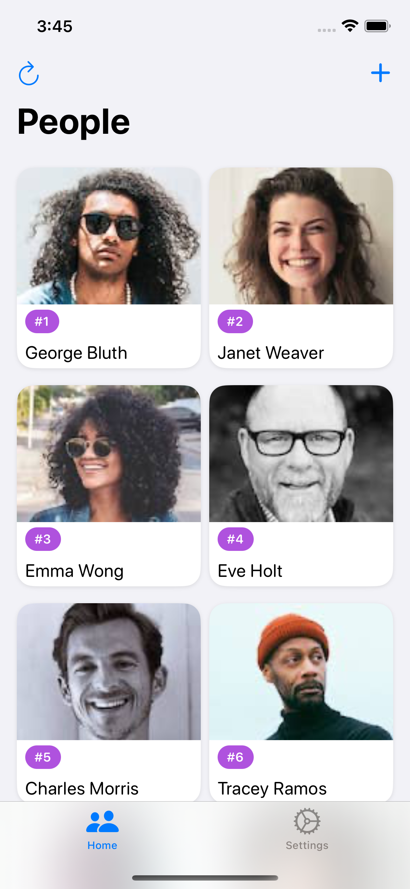
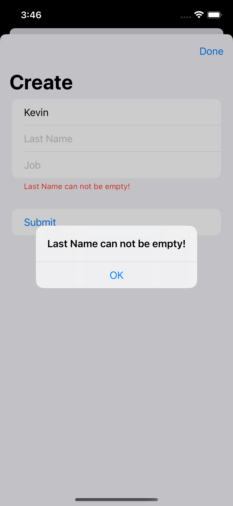
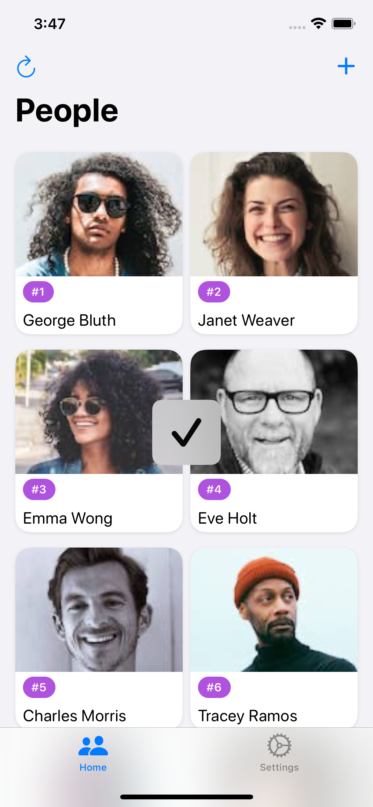
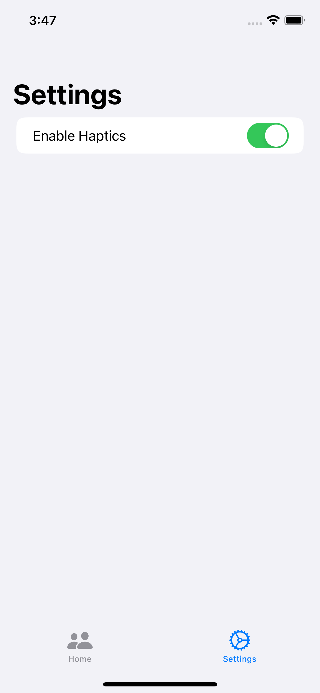

# TakeHomeProject_SwiftUI

## Table of contents
* [Video Link](#video-link)
* [Screenshots](#screenshots)
* [Features](#Features)
* [Architecture](#architecture)
* [Contact](#contact)

## Video Link

[TakeHomeProject_SwiftUI](https://www.linkedin.com/feed/update/urn:li:activity:7045763818789953536/)

## Screenshots

People Grid Screen         |  Detail Screen
:-------------------------:|:-------------------------:
 | 

Create Screen              |  Create Error Screen
:-------------------------:|:-------------------------:
 | 

Create Success Screen      |  Settings Screen
:-------------------------:|:-------------------------:
 | 

## Features 

- Check and understand the requirements in the Resource folder
- Check the mockup and understand the UI componenets that you are going to use for this project.
- Setup a project with SwiftUI
- Create a Folder for Resources and add the symbols that we are going to use for the app.
- Create Colors in assets that we are going to use in the app.
- Create project structure
- Add APP-Icon and Launch-Screen
- What is REST API and JSON.
- How to use Postman to Test API.
- How to work with Codable.
- How to work with Generics.
- Using Generics to Decode JSON.
- Building the People View in SwiftUI.
- Extracting Views into Components in SwiftUI.
- Using Local JSON to display information in the People View.
- Build the Detail View in SwiftUI.
- Using static JSON to load data in to our Detail View and navigate to it from the People View.
- Build, Present and Dismiss the Create People view.
- What is MVVM.
- Build a Networking Singleton in Swift with Generics.
- Using MVVM to create our People ViewModel.

- Threading in Swift.

1. Code is a series of instruction we tell the application to execute.

2. The application needs to perform this instructions somewhere and this is when Threads come in to use.

3. A Thread can execute a set of instructions.

4. Threads are managed by a Process.

5. A Process has at least one Thread that is executing some instructions.

1. The instructins in a Thread can be Synchronous or Asynchronous.

2. Synchronous code is executed one after the other.

3. Asynchronous code is code where you have to wait for something to retur before it can continue.

1. The Main Thread is the thread that is available to us for use.

2. Main Thread manages all the UI in our app.

3. You want to make sure that all the UI should be updated on the Main Thread. 

- Passing data between views in SwiftUI to get to the UserDetails.

- How to send a post request in swift to create a Person user.

- How to handle networking errors in swiftui.

- How to use a ProgressView for user feedback In SwiftUI.

- Adding An Animated Pop-Up View In SwiftUI

- Easy Form Validation In SwiftUI & AttributeGraph Warning Fix

- Adding Haptic Feedback and a Settings Screen in SwiftUI

- Clean Up Networking Code In Swift

- Update the App To Use Swift Concurrency.

- Stopping Unnecessary Data Fetching In SwiftUI

- Implement Infinite Scrolling & Pagination In SwiftUI

- What is Unit Testing, Integration, UI Testing & Benefits

1. Manual tests

a. Time consuming 

b. Miss case paths (not all case paths can be covered)

c. Effects on Other code

2. Benefits of Test

a. Save time by automating test

b. Build confidence

c. A type of documentation since we now have a source of truth for our code.

3. Types of tests

a. Unit tests

b. Integration test

c. UI test

4. Unit testing

a. Testing a small logic in to your app

5. Integration testing

a. combines different unit test modules to see how they work together in to a larger test. 

b. (Validation object and the create view model since they interact with one another and we can make sure that our validation tests are working properly before we use create to create a user)

6. UI testing

a. This will test the UI in our app and our flows.

b. Ex: Are the buttons disabled when we are fetching data from the network.

7. XCTest is the framework we use to write tests and it contains asserts to validate expressions.

- Unit Testing In Swift, Unit Testing our JSON Mapper

- Unit Testing Form Validation In Swift, Unit Testing Our Form Validator

- What is Dependency Injection, Dependency Injection For Beginners

1. It is used for separation of concerns.

2. Reusability of our code.

3. Easier to test

- What are Mocks & Stubs, The Difference Between Mocks & Stubs

1. They allow us to create a fake flow of data within our test

2. Stub: A simple fake object to help you write your tests, it helps us stimulate data that we want to send back

3. Mock: It helps us fake some interactions to simulate and verify a flow

4. A Stub helps us write code with a specific result.

5. A Mock helps us use stubs that can be asserted to validate a flow. 

- Unit Testing in Swift Concurrency, Unit Testing Networking Code in Swift Concurrency

- Create MockURLSessionProtocol for testing the URLSession response.

- Integration Tests in Swift Concurrency for People View Model

- Integration Tests in Swift Concurrency for Detail View Model

- Integration Tests in Swift Concurrency for Create View Model

- UI Testing in Swift UI

- UI Tests in SwiftUI for People View

- UI Testing Pushing To Screen In SwiftUI, How To Write UI Tests for Our DetailView

- UI Testing A Form In SwiftUI, How To Write UI Tests for Our CreateView

- Test Driven Development (TDD)

- Is the process to turn requirements into test cases and than write code to make this tests pass.

- Benefits:

a. Our code works and meets our requirements.

b. Validate that our test cases work.

c. The code we write is easy to test.

d. Can be used as a type of documentation.

e. Code can be refactored with confidence.

- The Process:

1. Requirements: Define the test cases you need

2. Make each test fail: Define each test and make them fail.

3. Write Logic: write unit test logic.

4. Make test pass: write code to make the code pass.

5. Make it better: refactor and improve the code. 

- What is code coverage

- Is a metric to help you understand how much of your code is tested by displaying it in percentage.

- Using Refreshable with Scrollviews in SwiftUI4.0 & Adding Backward Capability In SwiftUI

- Updating your SwiftUI app to use NavigationStack in SwiftUI4.0

- Preparing for the interview

## Architecture

### MVVM

#### Model:

- The Model layer is responsible for representing the data from our business logic.

#### View:

- The View layer is responsible for handling all the layouts and displaying the data user-friendly. 
- The View knows the ViewModel but doesn't know the model.

#### ViewModel:

- The ViewModel layer is responsible for transforming the data received in a View-representative way, receiving actions from the View, and dealing with our business logic.
- It contains data binding that tells whoever is listening about those changes. 
- The ViewModel Knows the Model layer but doesn’t know the View layer.

## Contact
Kevin Topollaj, email: kevintopollaj@gmail.com - feel free to contact me!
