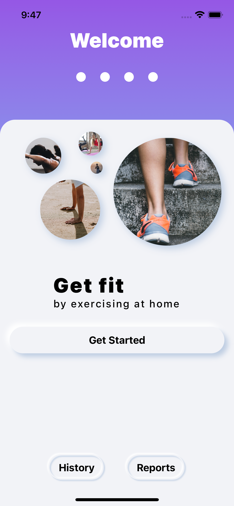
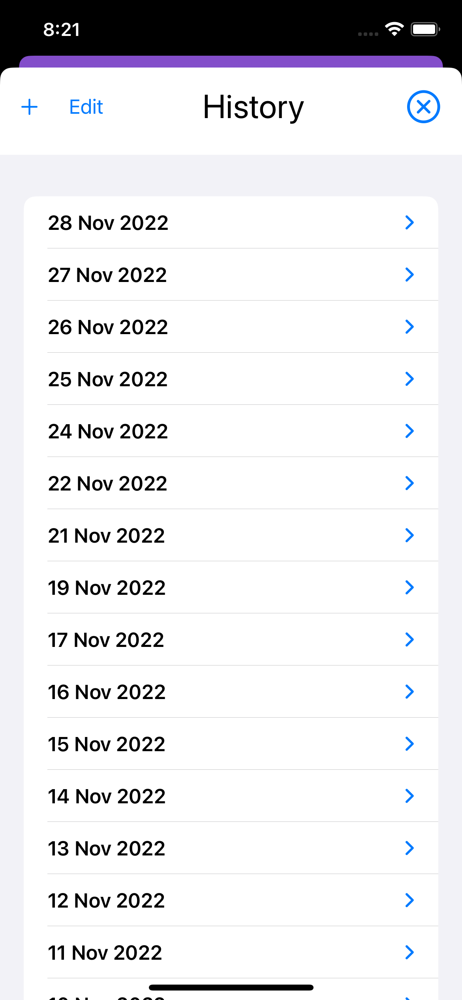
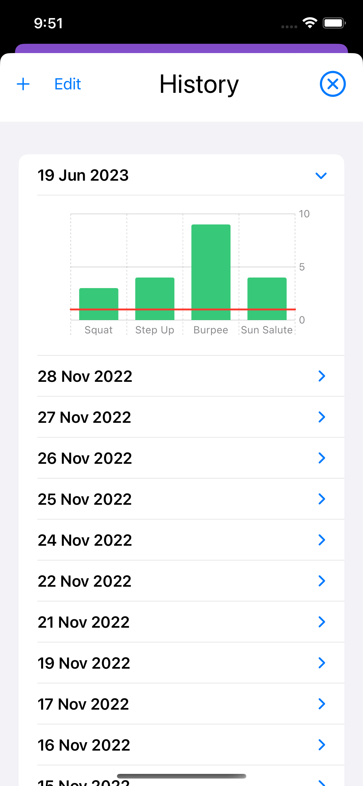
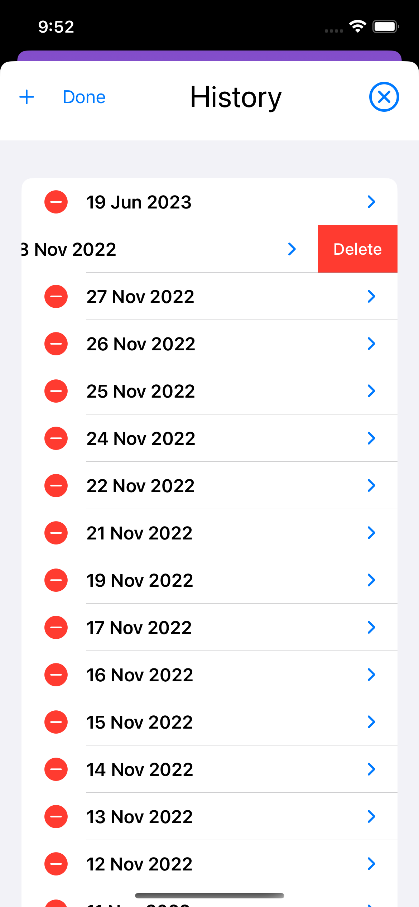
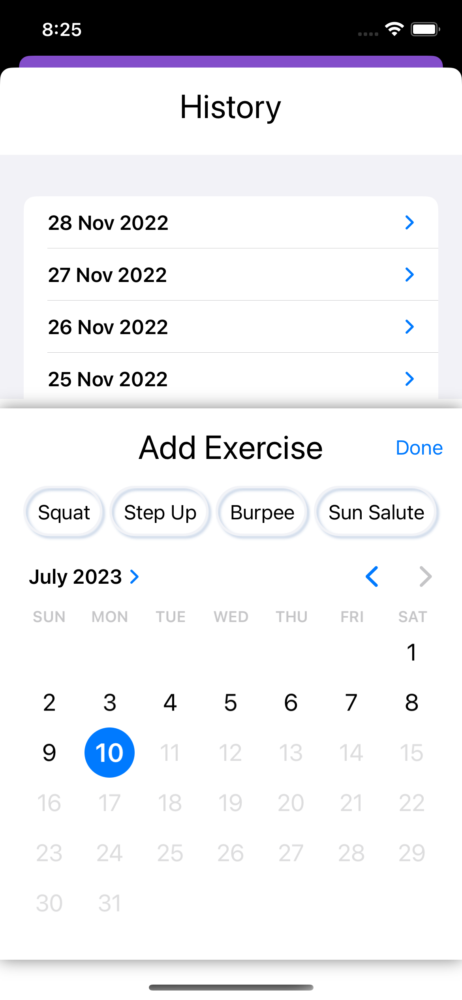
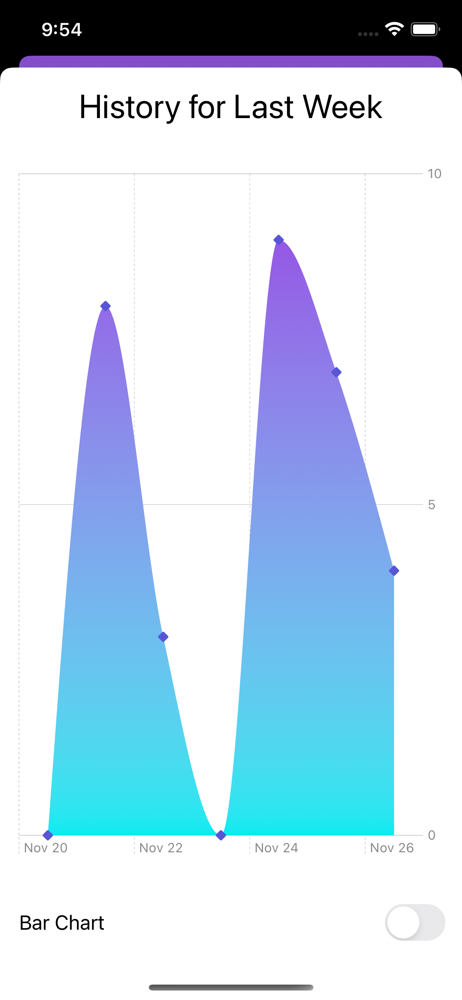
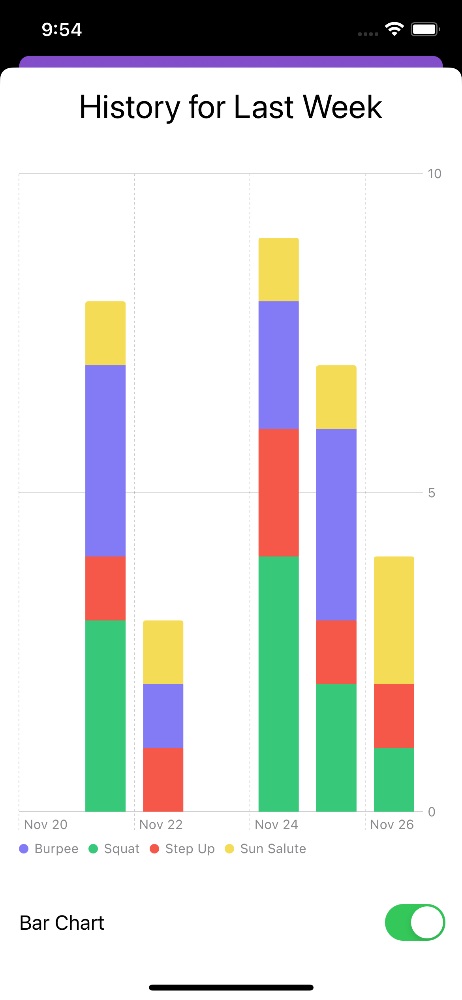
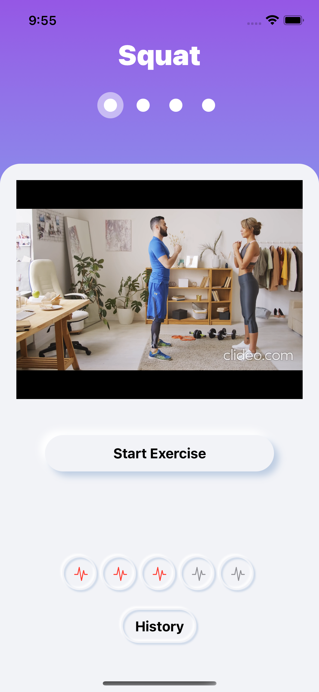
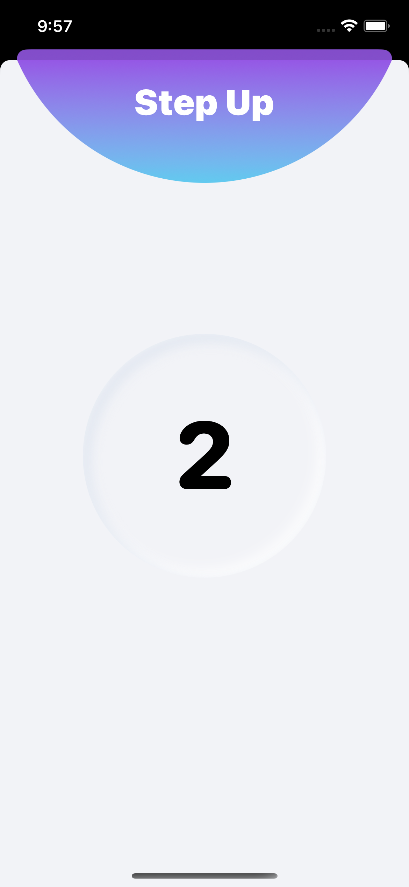
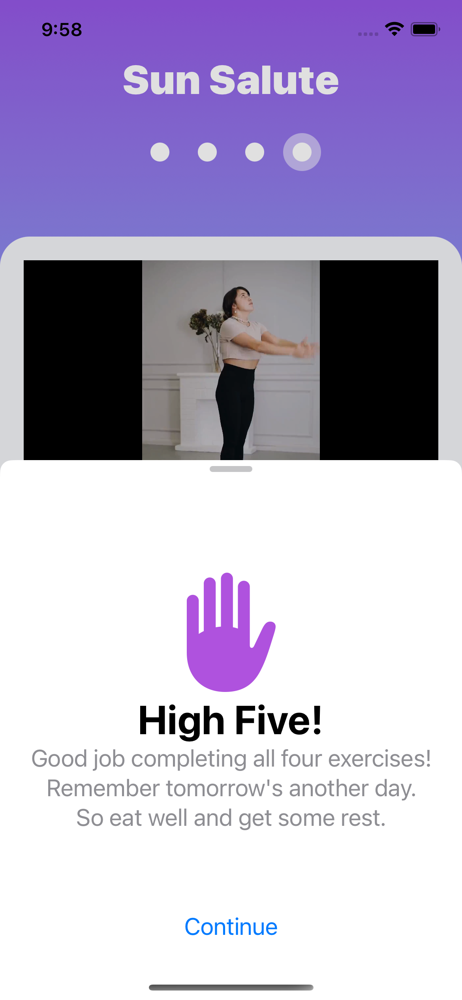

# HIITFit

## Table of contents
* [Video Link](#video-link)
* [Description](#description)
* [Features](#Features)
* [Screenshots](#screenshots)
* [Architecture](#architecture)
* [Contact](#contact)

## Video Link

[HIITFit](https://www.linkedin.com/feed/update/urn:li:activity:7099042396985815041/)

## Description

Introducing HIITFit, the iOS app powered by the cutting-edge SwiftUI framework.

Elevate your fitness journey to new heights with this beautifully designed application, carefully crafted to empower and inspire users of all levels.

HIITFit unveils a comprehensive library of exercise videos so immerse yourself in expert-guided workouts. Perfect your form and technique by watching seasoned professionals, ensuring every movement brings you closer to your goals.

But that's not all. HIITFit goes beyond just workouts. Seamlessly track your progress and gain valuable insights with comprehensive reporting and intuitive charting features.

Embark on each exercise with confidence, guided by our seamlessly integrated timer. Experience the power of precise time management as HIITFit keeps you in sync, optimizing every second of your workout.

Push your limits, break through barriers, and achieve unprecedented results.

Revolutionise the way you train. Unlock your true potential with HIITFit – where fitness meets innovation.

## Features 

### 1. Engaging Welcome Screen:

- Immerse yourself in the world of fitness with a captivating welcome screen, thoughtfully designed to combine compelling text, stunning visuals, and an intuitive button.

### 2. Comprehensive History Tracking:

- Effortlessly monitor your progress and achievements with the History screen. Keep a meticulous record of your daily exercises, allowing you to reflect on your fitness journey and track your growth over time. Stay motivated by witnessing your dedication and hard work paying off.

### 3. Seamless Editing Mode:

- Take control of your exercise history with ease. 
- The Edit feature enables you to enter editing mode and effortlessly remove items from your History list.
- Tailor your records to ensure accuracy and maintain a clear overview of your fitness accomplishments.

### 4. Effortlessly Add Exercises:

- Never miss a beat with the convenient Add screen, within the History section.
- If you forgot to log a workout, fear not.
- Simply select the date and exercises performed, ensuring your progress remains complete and accurately represented within the app.

### 5. Insightful Reports:

- Uncover valuable insights with the Reports screen.
- Discover weekly exercise reports presented through two comprehensive charts, allowing you to visualize trends, identify patterns, and make informed decisions to optimize your fitness routine.

### 6. Dynamic Exercise Details:

- Immerse yourself in the Exercise screen, where each exercise comes to life.
- Experience the exercise's name, accompanied by a detailed instructional video showcasing proper form and technique.
- Rate the exercise's difficulty level to personalize your fitness journey and tailor workouts to your capabilities.

### 7. Precision Timer:

- Stay in sync and maximize each exercise session with the Timer screen.
- Seamlessly integrated, the countdown timer corresponds precisely to the recommended exercise duration.
- Effortlessly push yourself and achieve optimal results with the guidance of this meticulously calibrated timer.

### 8. Celebratory High-Five:

- Completion brings celebration!
- The High-Five screen serves as the perfect conclusion to your workout journey.
- Feel a sense of accomplishment as you're greeted with a satisfying visual acknowledgement, motivating you to conquer your goals and strive for greatness.

## Screenshots

Welcome Screen             |  History Screen
:-------------------------:|:-------------------------:
 | 

History Screen Expanded    |  Edit History Screen
:-------------------------:|:-------------------------:
 | 

Add Exercises Screen       |  Report Screen Chart
:-------------------------:|:-------------------------:
 | 

Report Screen Bar Chart    |  Exercise Screen
:-------------------------:|:-------------------------:
 | 

Timer Exercise Screen      |  Exercise Completed Screen
:-------------------------:|:-------------------------:
 | 

## Architecture

### MVVM

#### Model:

- The Model layer is responsible for representing the data from our business logic.

#### View:

- The View layer is responsible for handling all the layouts and displaying the data user-friendly. 
- The View knows the ViewModel but doesn't know the model.

#### ViewModel:

- The ViewModel layer is responsible for transforming the data received in a View-representative way, receiving actions from the View, and dealing with our business logic.
- It contains data binding that tells whoever is listening about those changes. 
- The ViewModel Knows the Model layer but doesn’t know the View layer.

## Contact
Kevin Topollaj, email: kevintopollaj@gmail.com - feel free to contact me!
