# Cards

## Table of contents
* [Video Link](#video-link)
* [Description](#description)
* [Features](#Features)
* [Screenshots](#screenshots)
* [Architecture](#architecture)
* [Contact](#contact)

## Video Link

[Cards](https://www.linkedin.com/feed/update/urn:li:activity:7101579112758018049/)

## Description

Introducing Cards - An iOS App for Personalized Card Creations.

Unleash your creativity with Cards, a cutting-edge iOS app developed using SwiftUI. Experience a seamless and visually engaging journey as you craft and customize stunning cards to cherish and share with your loved ones.

Crafting heartfelt cards is a breeze with Cards' intuitive interface. Seamlessly combine photos, stickers, text, and frames to fashion unique expressions of your emotions.

Easily navigate through your collection of masterpieces with the dynamic grid and vertical scroll views, providing a delightful way to rediscover your cherished memories.

Enrich your cards with precious memories by effortlessly adding your favorite photos and choosing from an array of delightful frames to accentuate their charm.

Unleash your imagination and personalize your creations with a vast selection of expressive stickers and customizable text options, making every card truly one-of-a-kind.

Fine-tune your creations with ease by duplicating, transferring, and deleting content elements within your cards, ensuring perfection in every detail.

Capture the essence of your creations by saving your cards as high-quality images, ready to be shared with family, friends, and across your favorite social platforms.

Maintain a clutter-free card collection by effortlessly managing and deleting cards, ensuring a seamless experience every time you revisit your creative achievements.

Cards is the definitive choice for iOS users seeking an immersive, user-friendly, and versatile app to transform cherished moments into tangible expressions of love and joy.

## Features 

### 1. Splash Screen with animation :

- A captivating animated entry point that enhances user experience and sets the tone for the app.

### 2. Create a new Card:

- Allows users to effortlessly generate personalized cards with various content elements.

### 3. View Cards in Grid:

- Presents an organized grid layout of created cards for easy visual exploration.

### 4. View Cards in Vertical Scroll:

- Enables seamless vertical scrolling through the collection of cards, ensuring smooth navigation.

### 5. Add a Photo to the Card:

- Enables users to enrich their cards with personal images, enhancing customization options.

### 6. Add Frames to the Card photo:

- Provides a selection of frames to adorn the card photos, adding a touch of creativity.

### 7. Add Stickers to the Card:

- Offers an array of stickers for users to creatively embellish their cards.

### 8. Add Text to the Card:

- Facilitates the addition of personalized text, allowing users to express themselves.

### 9. Copy or Delete the item in the Card:

- Allows users to duplicate or remove specific content elements within cards.

### 10. Paste copied item to the Card:

- Enables seamless content transfer between cards, enhancing user efficiency.

### 11. Save the Card as an Image:

-  Empowers users to export their completed card as a standalone image for easy sharing.

### 12. Delete the Card:

- Provides an option to delete unwanted cards, ensuring a clutter-free card collection.

## Screenshots

Splash Screen              |  Create New Card Screen
:-------------------------:|:-------------------------:
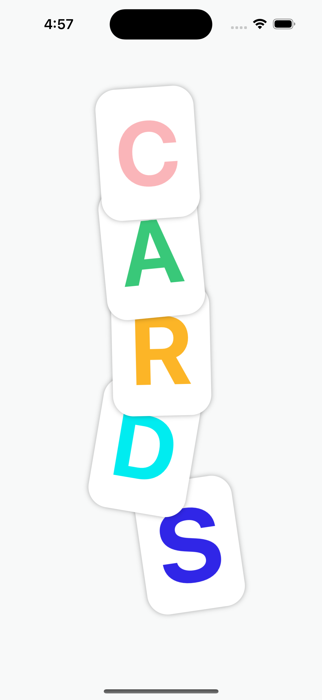          |  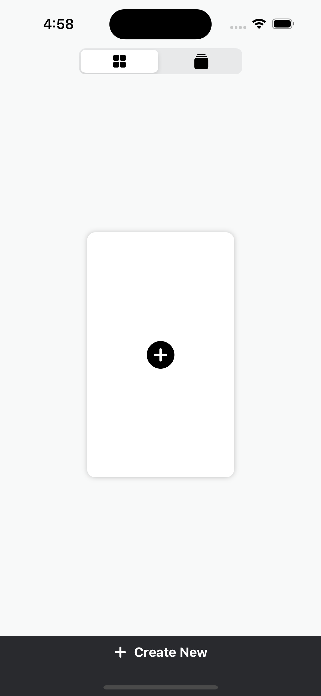

View Cards in Grid Screen  | View Cards in Vertical Scroll Screen
:-------------------------:|:-------------------------:
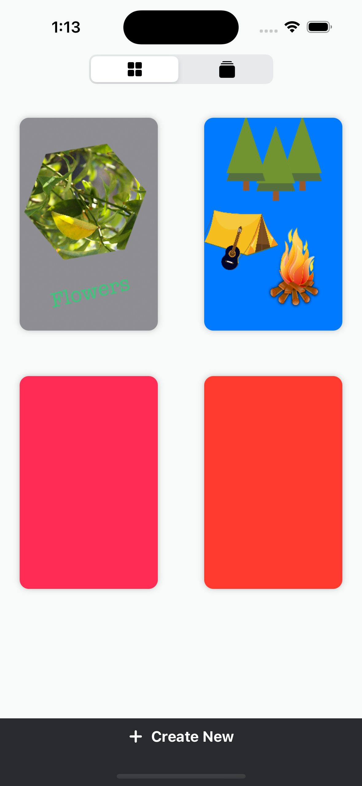          |  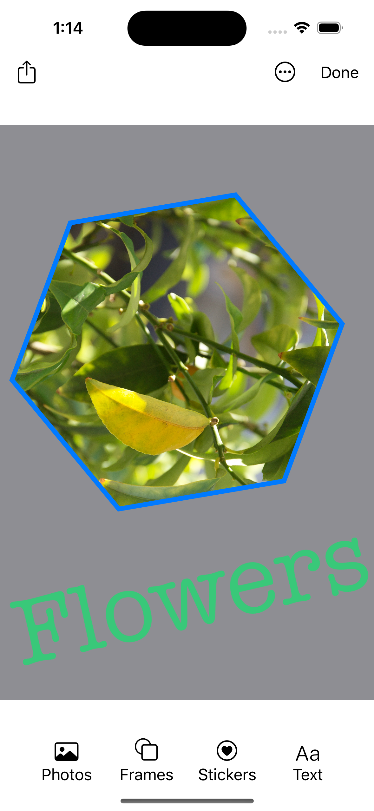

Add Photo Screen           |  Add Frames Screen
:-------------------------:|:-------------------------:
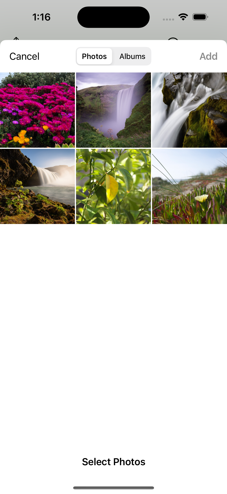          |  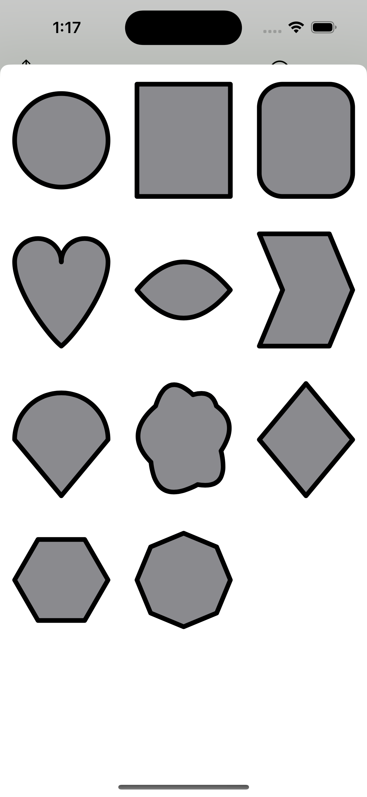

Add Stickers Screen        |  Add Text Screen
:-------------------------:|:-------------------------:
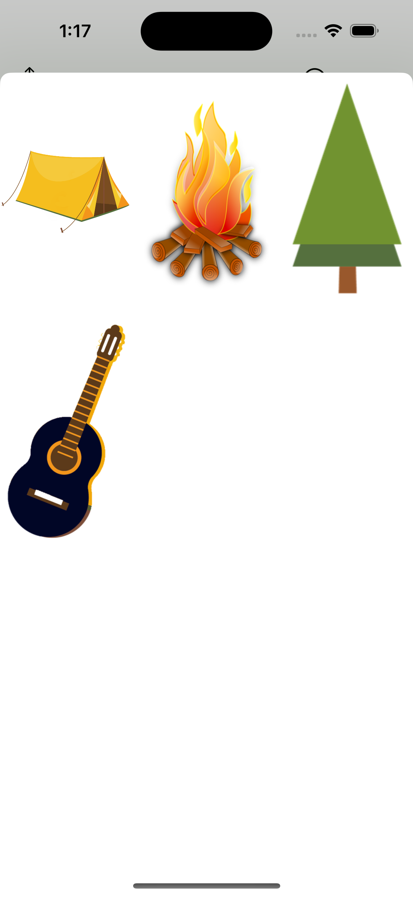          |  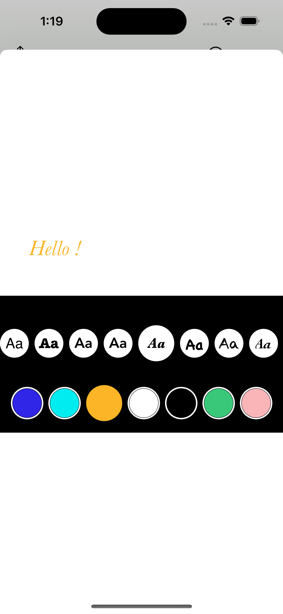

Copy and Delete Item       |  Paste Item
:-------------------------:|:-------------------------:
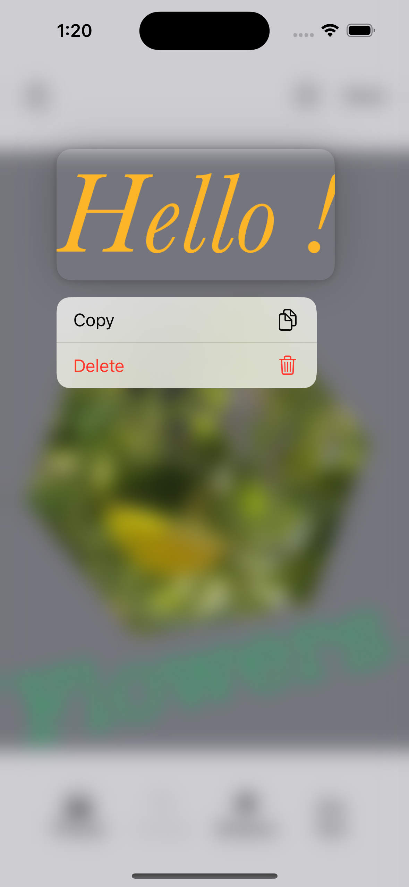          |  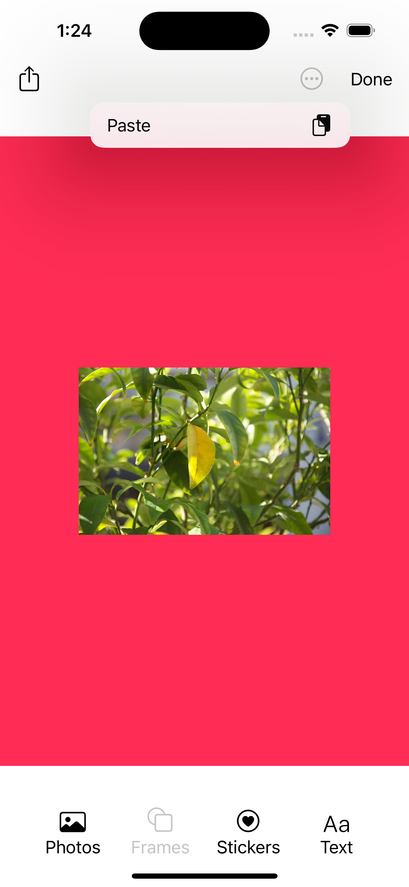

Save Card as Image Screen  |  Delete Card Screen
:-------------------------:|:-------------------------:
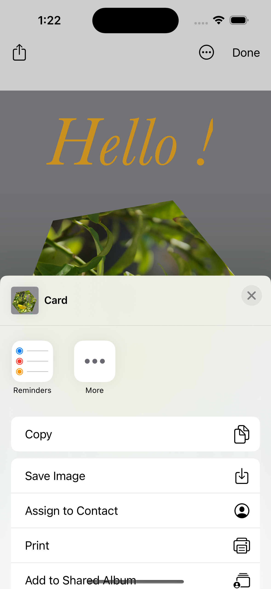         |  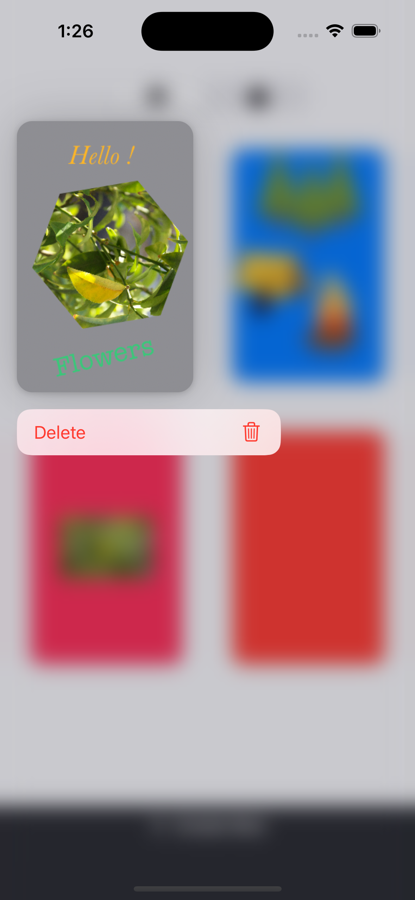

## Architecture

### MVVM

#### Model:

- The Model layer is responsible for representing the data from our business logic.

#### View:

- The View layer is responsible for handling all the layouts and displaying the data user-friendly. 
- The View knows the ViewModel but doesn't know the model.

#### ViewModel:

- The ViewModel layer is responsible for transforming the data received in a View-representative way, receiving actions from the View, and dealing with our business logic.
- It contains data binding that tells whoever is listening about those changes. 
- The ViewModel Knows the Model layer but doesn’t know the View layer.

## Contact
Kevin Topollaj, email: kevintopollaj@gmail.com - feel free to contact me!
