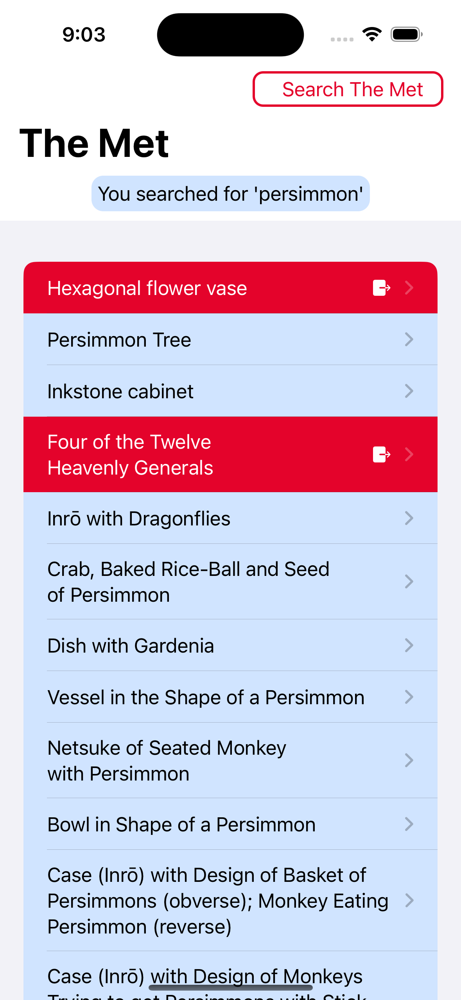
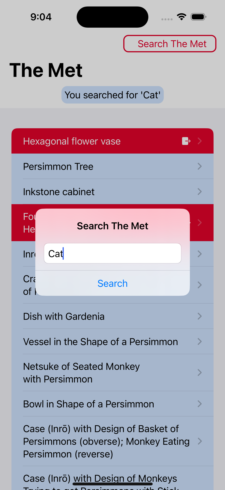
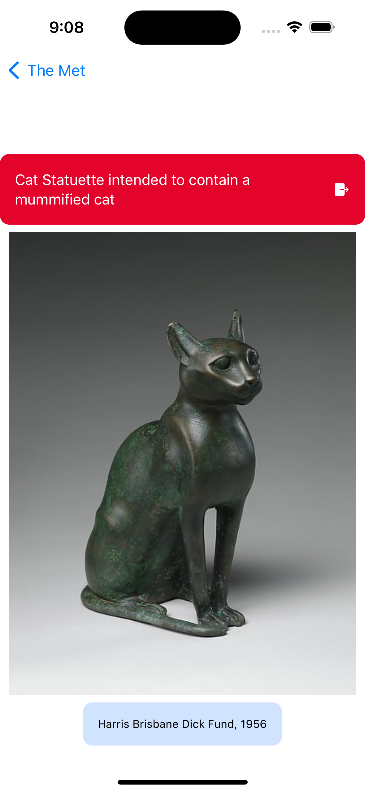
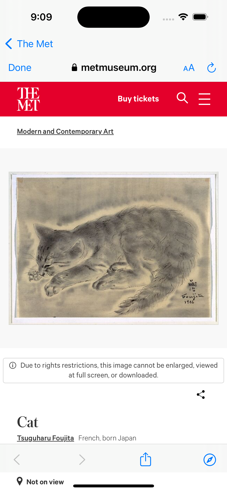
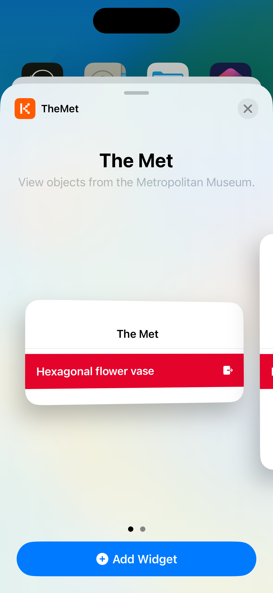
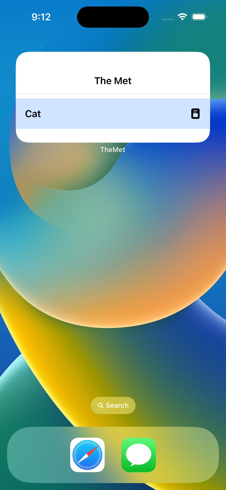

# TheMet

## Table of contents
* [Video Link](#video-link)
* [Screenshots](#screenshots)
* [Description](#description)
* [Features](#Features)
* [Architecture](#architecture)
* [Contact](#contact)

## Video Link

[TheMet](https://www.linkedin.com/feed/update/urn:li:activity:7104115836373602304/)

## Screenshots

Item List Screen           |  Search Popup Screen
:-------------------------:|:-------------------------:
 | 

Item Detail Screen         |  Safari Detail Screen
:-------------------------:|:-------------------------:
 | 

Add Widget Screen          |  Widget Screen
:-------------------------:|:-------------------------:
 | 

## Description

TheMet is a sophisticated and immersive iOS app developed using SwiftUI, designed to provide an enriching experience for users while exploring The Metropolitan Museum of Art in New York. Seamlessly blending cutting-edge technology with an exquisite user interface, TheMet offers an array of powerful features:

The app displays an Item List screen, presenting users with a curated selection of items sourced from The Metropolitan Museum of Art. By utilizing an intuitive search functionality, users can easily find items that match their query, enhancing their journey through the museum.

Items with public accessibility are gracefully distinguished by a light blue background, inviting users to explore them further with a simple tap.

In contrast, non-public items feature an elegant red background, enabling users to effortlessly access additional information by seamlessly transitioning to Safari.

The Search Popup screen empowers users with a user-friendly interface for conducting dynamic searches across the museum's vast collection. Leveraging the app's API capabilities, users can access the latest items matching their search criteria, as the entire list refreshes with real-time updates.

The Item Detail screen provides comprehensive information about each selected item. By presenting users with a direct link to explore the item in Safari, along with captivating images utilizing AsyncImage and informative captions, TheMet ensures a captivating and enriching experience.

For non-public items, the Safari Detail screen seamlessly guides users to delve deeper into the item's historical and cultural significance. By elegantly opening the corresponding item in Safari, users can access an abundance of detailed information, further enhancing their exploration.

The app extends its functionality beyond the core experience with the Add Widget screen, enabling users to personalize their iOS device by effortlessly integrating TheMet's widget into their home screen. Stay informed about the latest featured items with ease and convenience.

Finally, The Widget screen reinforces the app's commitment to user engagement by offering direct access to featured items from the iOS device's home screen. When a user selects an item from the widget, the app seamlessly transitions to the corresponding Detail screen, ensuring a fluid and uninterrupted exploration.

## Features 

### 1. Item List Screen :

- The Item List screen presents a comprehensive collection of items sourced from The Metropolitan Museum of Art, New York, meticulously filtered to match the user's specific query term.

- Items with public accessibility are distinguishable by a refined light blue background, and upon selection, the app navigates to the Detail screen to present exhaustive information about the selected item.

- On the other hand, if an item is deemed non-public, it is presented with an elegant red background, and upon selection, the app seamlessly opens the corresponding item in Safari, allowing users to delve deeper into its details.

### 2. Search Popup Screen:

- The Search Popup screen constitutes a user-friendly interface enabling users to conduct seamless searches across The Metropolitan Museum of Art's vast collection.

- By leveraging the API's capabilities, users can discover diverse items matching their search criteria.

- Upon submitting a new query, the entire list elegantly refreshes with the latest elements from the search, providing users with real-time updates on relevant items.

### 3. Item Detail Screen:

- The Item Detail screen offers an immersive and informative experience, delivering in-depth information about a selected item from The Metropolitan Museum of Art's esteemed collection.

- Displayed with utmost elegance, the screen incorporates essential components such as a direct link for further exploration of the item in Safari, a captivating image utilizing the efficient AsyncImage, and a captivating caption to provide context and enrich the user's understanding of the item's significance.

### 4. Safari Detail Screen:

- The Safari Detail screen is meticulously designed to provide users with a seamless transition into exploring non-public items from The Metropolitan Museum.

- When a user selects a non-public item, the app promptly opens the corresponding item in Safari, where users can access an abundance of detailed information, allowing them to delve deeper into the item's historical and cultural significance.

### 5. Add widget Screen:

- The Add Widget screen empowers users to personalize their experience by seamlessly incorporating TheMet app's widget into their iOS device.

- This intuitive screen guides users through the process of adding the widget, enabling them to effortlessly stay informed about the latest showcased items.

### 6. Widget Screen:

- The Widget screen stands as a testament to the app's dedication to enhancing user convenience and engagement.

- With the widget in place, users can easily access featured items directly from their iOS device's home screen.

- Upon selecting an item from the widget, the app smoothly transitions to the corresponding Detail screen, ensuring a seamless and uninterrupted exploration of the chosen item.

## Architecture

### MVVM

#### Model:

- The Model layer is responsible for representing the data from our business logic.

#### View:

- The View layer is responsible for handling all the layouts and displaying the data user-friendly. 
- The View knows the ViewModel but doesn't know the model.

#### ViewModel:

- The ViewModel layer is responsible for transforming the data received in a View-representative way, receiving actions from the View, and dealing with our business logic.
- It contains data binding that tells whoever is listening about those changes. 
- The ViewModel Knows the Model layer but doesn’t know the View layer.

## Contact

Kevin Topollaj, email: kevintopollaj@gmail.com - feel free to contact me!
