# Pet Save App

## Table of contents
* [Video Link](#video-link)
* [Description](#description)
* [Features](#Features)
* [Screenshots](#screenshots)
* [Architecture](#architecture)
* [Contact](#contact)

## Video Link

[PetSave](https://www.linkedin.com/feed/update/urn:li:activity:7116791851965161472/)

## Description

PetSave is an iOS app developed using SwiftUI framework that aims to connect animal lovers with their perfect furry companions. With a focus on adoption and fostering, PetSave goes beyond traditional pet-finding platforms by considering both the medical history of pets and the personal preferences of potential owners, ensuring a seamless and tailored adoption experience.

PetSave has been developed adhering to the highest iOS development standards and best practices, ensuring a robust and maintainable codebase.

Experience the Joy of Pet Adoption with PetSave - your all-in-one companion for finding and welcoming your new furry friend into your home.

## Features 

### 1.Onboarding:

- PetSave provides a user-friendly onboarding process to acquaint you with its extensive range of features. Get introduced to the app's intuitive interface, discover how to make the most of its functionalities, and embark on your journey to pet adoption.

### 2.Animals Near You:

- Utilizing your current location, PetSave's identifies pets available for adoption in your area. Discover a wide range of lovable animals just waiting to find their forever homes. Whether you're searching for a loyal canine companion or a cuddly feline friend, PetSave helps you find the perfect match in your vicinity.

### 3.Search:

- PetSave's search feature allows you to fine-tune your quest for the ideal pet. Refine your search based on specific attributes, such as breed, size, age, and more. Find exactly what you're looking for, ensuring a seamless integration of your new family member into your lifestyle.

### Best Practices for Implementing PetSave's Features:

#### 1.Low Coupling and High Cohesion:

- PetSave's implementation focuses on maintaining low coupling and high cohesion in its codebase. This design philosophy minimizes dependencies between code elements, promoting reusability and simplifying future maintenance. By achieving a well-structured and modular codebase, PetSave has a scalable and sustainable solution.

#### 2.Proper Code Structure:

- PetSave follows the SOLID principles, ensuring a well-organized code structure. Components are divided into logical layers and segments, enhancing code clarity, comprehensibility, and maintainability. This approach facilitates efficient implementation of new features.

#### 3.Data Layer and Networking:

- PetSave incorporates a dedicated networking layer with a focus on high cohesion. This enables reusability for future projects by implementing networking logic using async/await, ensuring efficient and reliable communication with backend services.

#### 4.Persistence with CoreData:

- PetSave harnesses the capabilities of CoreData for efficient local storage and retrieval of network data. By reducing reliance on repeated network requests, the app optimizes performance, preserves valuable resources like the user's data plan, and delivers a seamless user experience.

#### 5.Testing:

- PetSave includes comprehensive tests for the network layer and data persistence layer, utilizing CoreData. By implementing thorough testing practices, the app ensures the reliability and stability of these critical components.

#### 6.Modular App Features with Swift Package Manager:

- PetSave embraces a modular approach, encapsulating app features into separate modules. This modular design promotes code reuse, minimizes the likelihood of bugs, and enhances overall app stability. Swift Package Manager is employed to facilitate module management and dependency resolution.

#### 7.Animations and Custom Controls:

- PetSave incorporates captivating animations and custom controls to provide an engaging and immersive user experience. These visually appealing elements contribute to a memorable interaction, fostering user engagement and retention.

#### 8.Accessibility and Localization:

- PetSave prioritizes inclusivity by implementing dynamic text, adhering to proper color usage, and ensuring compatibility with VoiceOver. By accommodating diverse user needs, PetSave aims to make the app accessible to a wider audience. Additionally, PetSave supports localization to cater to users worldwide, providing a localized experience for different locales.

#### 9.App Privacy:

- PetSave adheres to Apple's guidelines for app privacy. It properly requests user permissions for accessing device features and provides transparent information about the collection and usage of user data. By prioritizing privacy and building user trust, PetSave safeguards user privacy and ensures compliance with privacy regulations.

## Screenshots

Onboarding Screen1         |  Onboarding Screen2
:-------------------------:|:-------------------------:
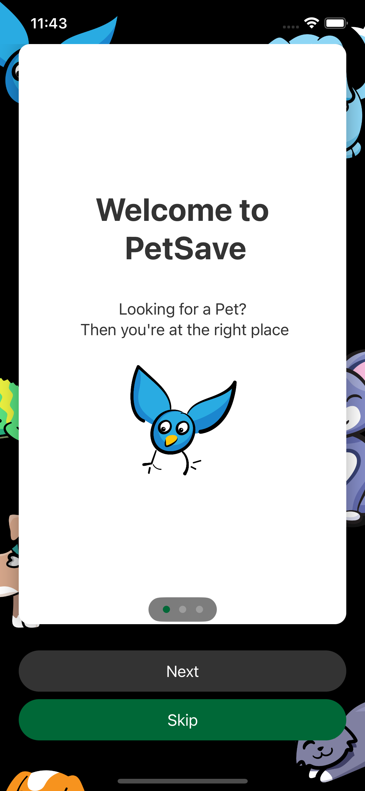          |  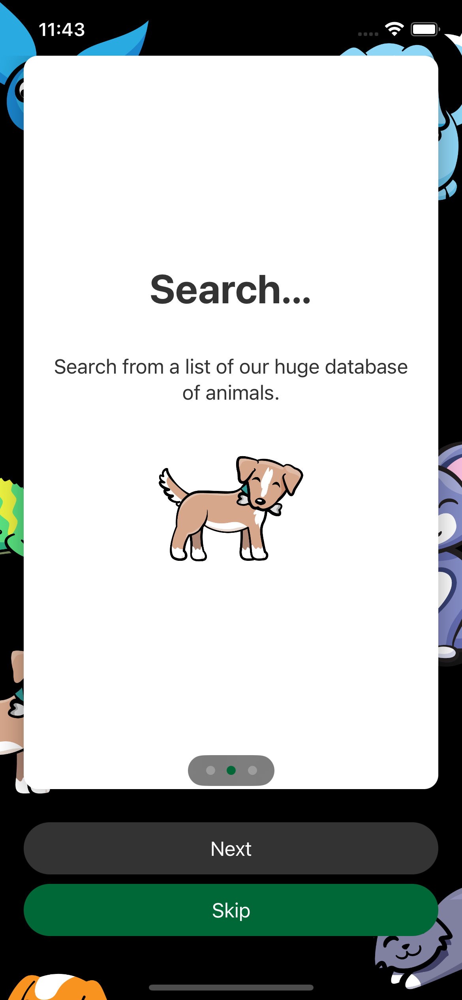

Onboarding Screen3         |  Share Location Screen
:-------------------------:|:-------------------------:
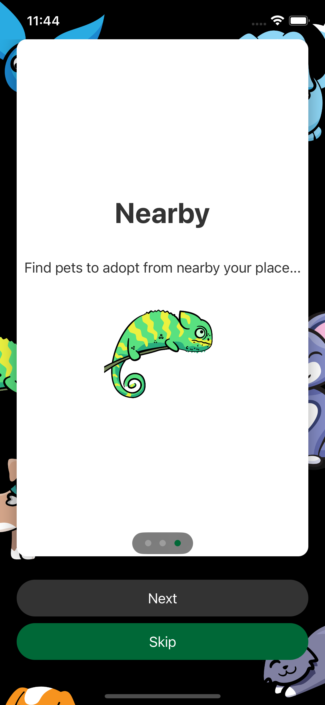          |  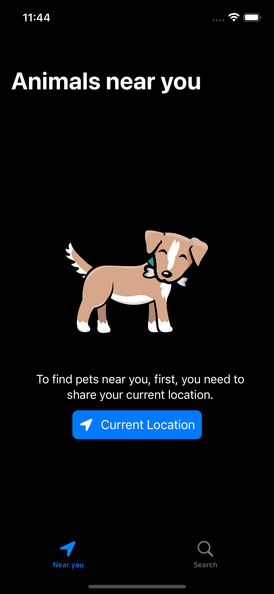

Location Popup             |  Animal Near You Screen
:-------------------------:|:-------------------------:
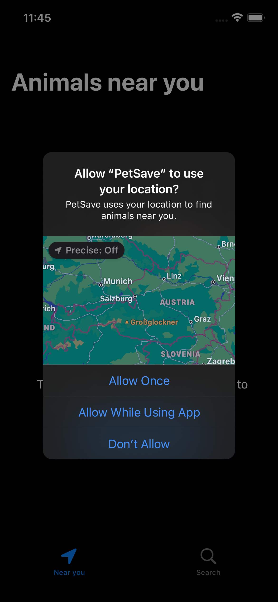          |  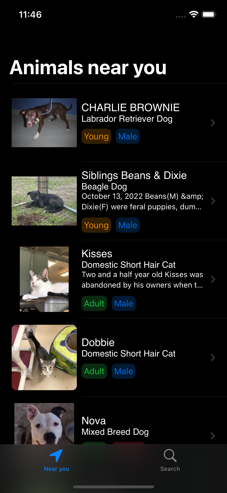

Animal Detail Screen       |  Animal Profile Picture
:-------------------------:|:-------------------------:
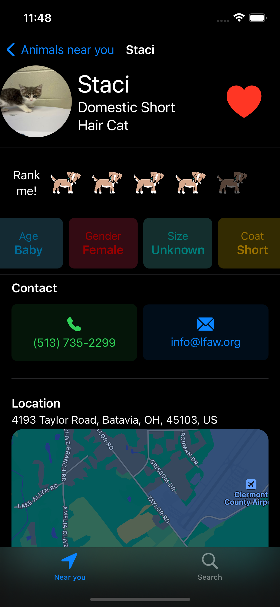          |  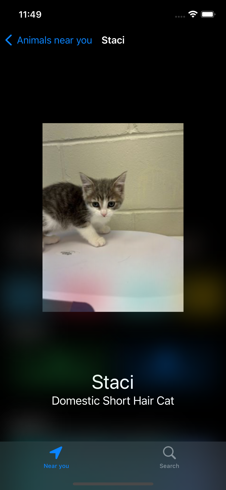

Search Screen              |  Search Filter Screen
:-------------------------:|:-------------------------:
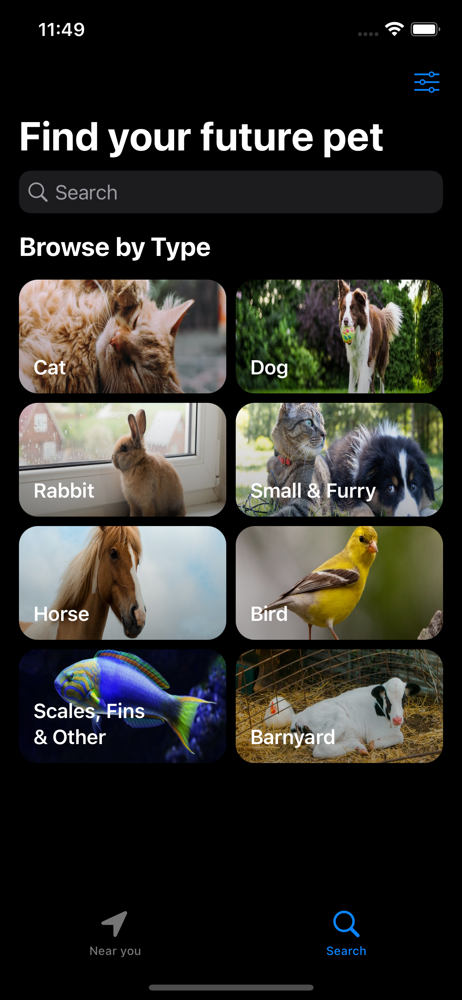          |  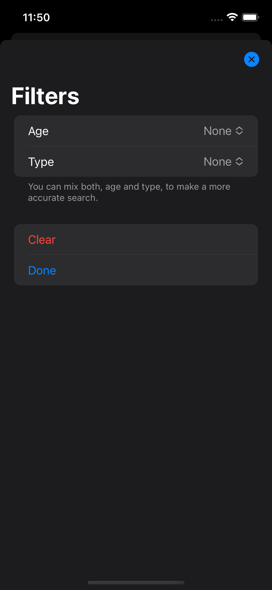

Search Filter Sections     |  Search Results Screen
:-------------------------:|:-------------------------:
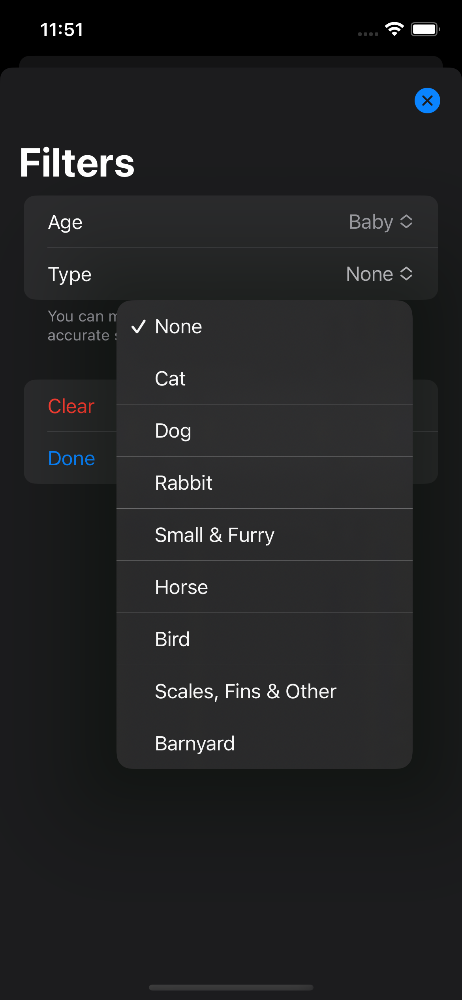         |  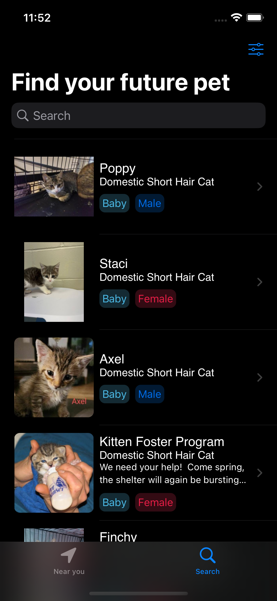

## Architecture

### MVVM

#### Model:

- The Model layer is responsible for representing the data from our business logic.

#### View:

- The View layer is responsible for handling all the layouts and displaying the data user-friendly. 
- The View knows the ViewModel but doesn't know the model.

#### ViewModel:

- The ViewModel layer is responsible for transforming the data received in a View-representative way, receiving actions from the View, and dealing with our business logic.
- It contains data binding that tells whoever is listening about those changes. 
- The ViewModel Knows the Model layer but doesn’t know the View layer.

## Contact
Kevin Topollaj, email: kevintopollaj@gmail.com - feel free to contact me!
