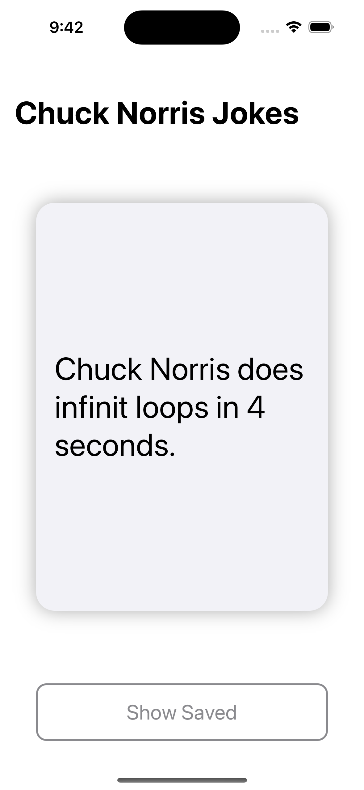
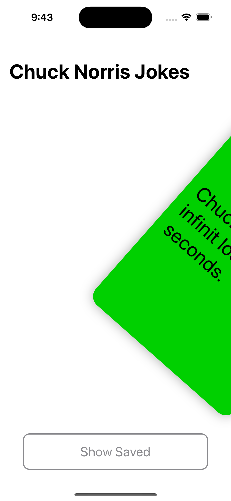
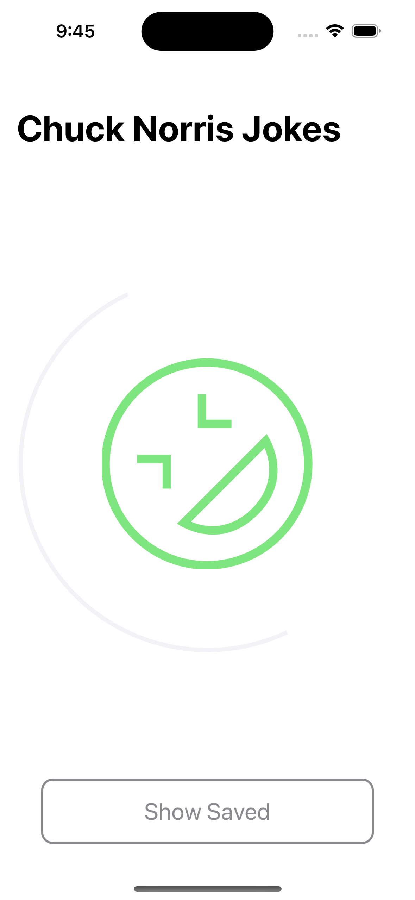
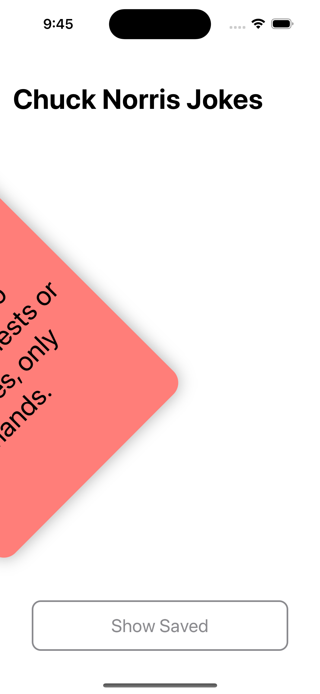
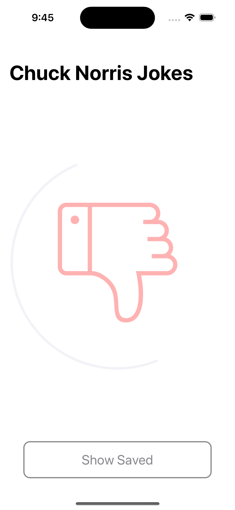
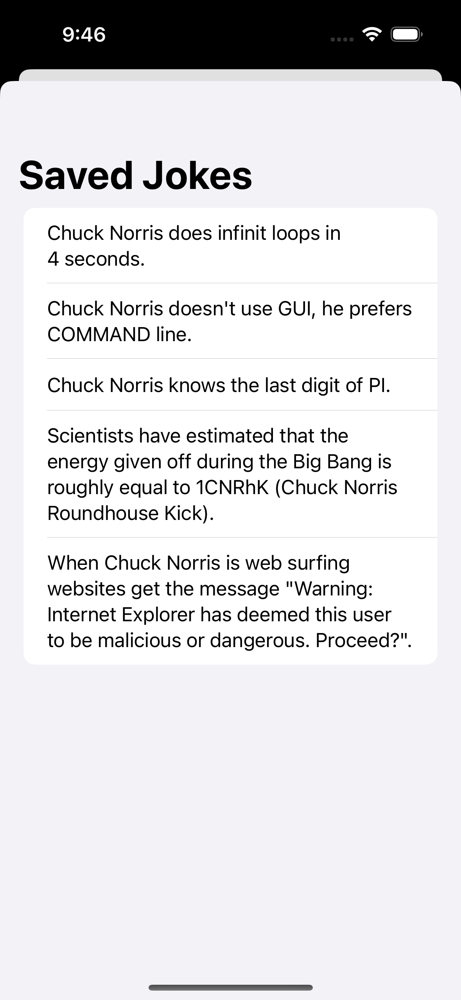
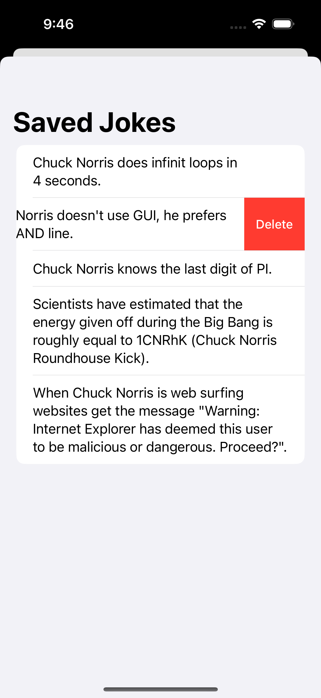

# Chuck Norris Jokes App

## Table of contents
* [Video Link](#video-link)
* [Screenshots](#screenshots)
* [Description](#description)
* [Features](#Features)
* [Architecture](#architecture)
* [Contact](#contact)

## Video Link

[ChuckNorrisJokesApp](https://www.linkedin.com/feed/update/urn:li:activity:7144718372037996544/)

## Screenshots

Fetching API Data          |  Swipe right
:-------------------------:|:-------------------------:
 | 

Swipe right HUD            |  Swipe left
:-------------------------:|:-------------------------:
 | 

Swipe left HUD             |  List of saved jokes
:-------------------------:|:-------------------------:
 | 

Delete an item in the list |  
:-------------------------:|
 |

## Description

Introducing Chuck Norris Jokes for iOS, an application that seamlessly blends the power of SwiftUI and Combine framework. This app leverages the capabilities of these cutting-edge technologies to bring you an unparalleled experience.

Chuck Norris Jokes connects with a dynamic API to source a rich collection of jokes. As you explore the world of Chuck Norris jokes, you'll have the intuitive ability to interact with each one. Swipe left to express your disinterest or swipe right to embrace the humor.

What sets this app apart is its intelligent integration of Core Data, where your preferences are stored with precision. Any joke you adore is dutifully recorded in Core Data, ensuring that your personal collection remains at your fingertips. A simple tap on the "Show Saved" button reveals a carefully curated list of your cherished jokes, allowing you to revisit them at any time.

We understand that humor is subjective, and your tastes may evolve over time. That's why we've made it effortless to maintain your collection. A gentle swipe to the left on any saved joke removes it from your list, adapting your collection to your refined sense of humor.

Experience the ultimate in joke curation and personalization with Chuck Norris Jokes for iOS. Discover, savor, and tailor your laughter journey like never before.

## Features 

### 1.Fetching Data from the API:

- Chuck Norris Jokes seamlessly retrieves data from a dynamic API source. Ensuring that you're always greeted with fresh and humorous content.

### 2.Display the Data Using SwiftUI:

- SwiftUI is used to create an aesthetically pleasing and highly responsive user interface. Enjoy a visually stunning presentation of Chuck Norris jokes, meticulously designed for your viewing pleasure.

### 3.Manage the State of the App Using Combine:

- Chuck Norris Jokes employs the Combine framework to handle the app's state gracefully. This cutting-edge technology ensures that your interactions with the app are seamless and that real-time updates are effortlessly integrated, providing a fluid and engaging user experience.

### 4.Saving and Deleting Data Using Core Data:

- Your laughter is valuable, and Chuck Norris Jokes goes the extra mile to preserve your favorite jokes. With Core Data integration, you can easily save jokes and they're always at your fingertips. But we also understand that humor can change over time. Deleting jokes is a breeze with the intuitive swipe feature, allowing you to refine your collection effortlessly and adapt it to your evolving sense of humor.

## Architecture

### MVVM

#### Model:

- The Model layer is responsible for representing the data from our business logic.

#### View:

- The View layer is responsible for handling all the layouts and displaying the data user-friendly. 
- The View knows the ViewModel but doesn't know the model.

#### ViewModel:

- The ViewModel layer is responsible for transforming the data received in a View-representative way, receiving actions from the View, and dealing with our business logic.
- The ViewModel Knows the Model layer but doesn’t know the View layer.
- It contains data binding that tells whoever is listening about those changes using the Combine framework. 

## Contact
Kevin Topollaj, email: kevintopollaj@gmail.com - feel free to contact me!
