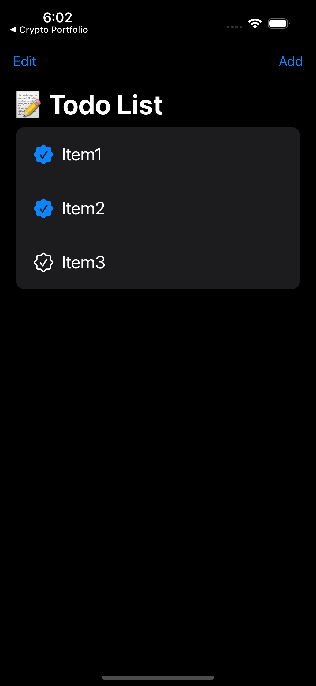

# ToDo List App

## Table of contents
* [Video Link](#video-link)
* [Description](#description)
* [Features](#Features)
* [Screenshots](#screenshots)
* [Architecture](#architecture)
* [Contact](#contact)

## Video Link

[TodoList](https://www.linkedin.com/feed/update/urn:li:activity:7139667588699123713/)

## Description

Elevate your task management experience with the SwiftUI-powered Todo List app. Effortlessly add, delete, and edit items with user-friendly controls. Take advantage of the intuitive Edit Mode to rearrange tasks, ensuring optimal organisation. Plus, enjoy peace of mind as your data persists, seamlessly saving your list so you can pick up where you left off. Streamline your productivity and conquer your to-do's with the Todo List app.

## Features 

### 1.Adding items to the list:

- Empower your productivity by effortlessly adding new items to your Todo List. Seamlessly use the "Add New Item" button on the main screen when there are no items in the list or the convenient "Add" button in the navigation bar to incorporate tasks into your list.

### 2.Deleting items from the list:

- Maintain a clutter-free experience with the intuitive swipe to delete feature. Simply swipe to remove completed items from your list, so you can ensure you focus only on what lies ahead.

### 3.Edit mode for the list:

- Take control of your task management with the Edit Mode. By selecting the "Edit" button in the left side of the navigation bar, you can efficiently customise your list, making adjustments and fine-tuning details to suit your evolving priorities.

### 4.Moving item in the list:

- Customise your task organisation effortlessly with the Edit Mode. Arrange, reorganise, and delete items with ease, giving you the flexibility to structure your list according to your workflow and preferences.

### 5.Saving items to persist the data:

- Experience continuity in your productivity journey. Todo List app ensures data persistence by automatically saving your items. Every time you close the app, rest assured that your tasks are securely stored, ready to greet you upon your next launch. Never worry about losing progress again.

## Screenshots

Empty List Screen          |  Add Item Screen
:-------------------------:|:-------------------------:
          |  

ToDo List Screen1          |  ToDo List Screen2
:-------------------------:|:-------------------------:
          |  

Swipe to delete            | Edit Mode Screen
:-------------------------:|:-------------------------:
          |

## Architecture

### MVVM

#### Model:

- The Model layer is responsible for representing the data from our business logic.

#### View:

- The View layer is responsible for handling all the layouts and displaying the data user-friendly. 
- The View knows the ViewModel but doesn't know the model.

#### ViewModel:

- The ViewModel layer is responsible for transforming the data received in a View-representative way, receiving actions from the View, and dealing with our business logic.
- The ViewModel Knows the Model layer but doesn’t know the View layer.
- It contains data binding that tells whoever is listening about those changes using the Combine framework. 

## Contact
Kevin Topollaj, email: kevintopollaj@gmail.com - feel free to contact me!
