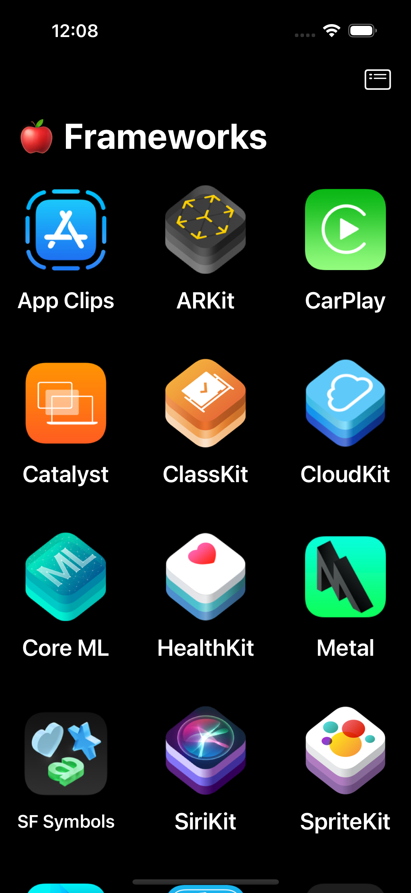
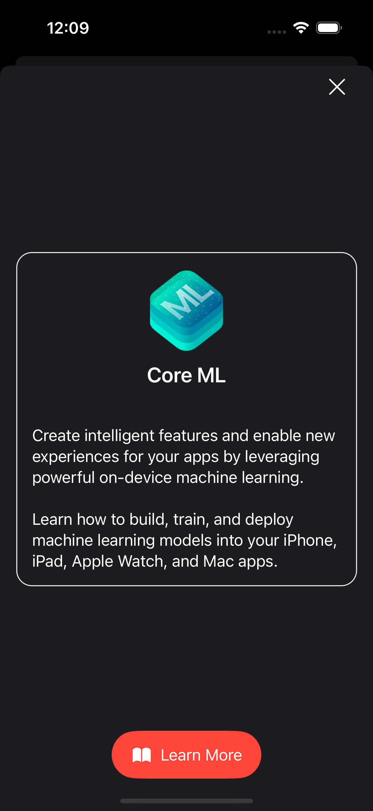
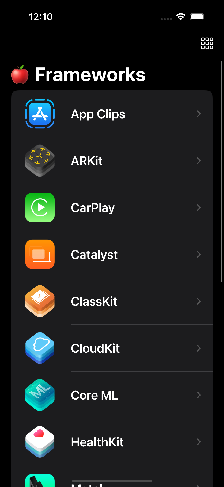
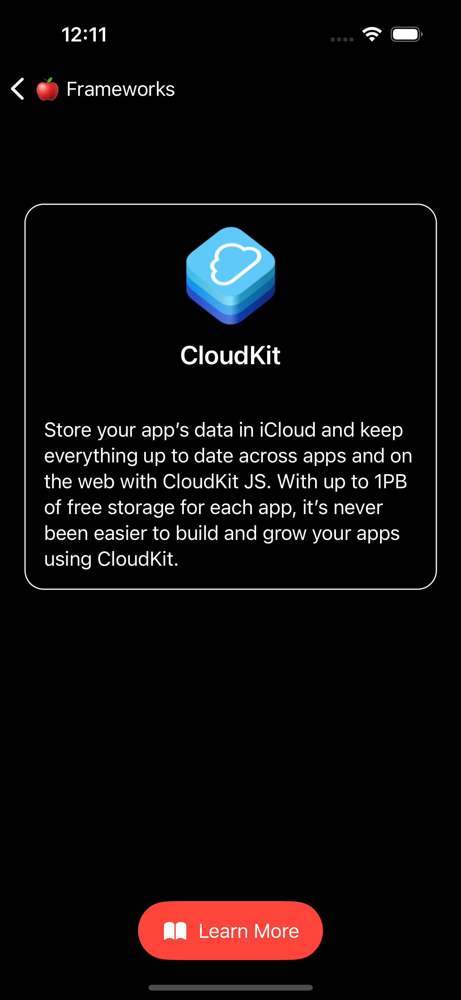
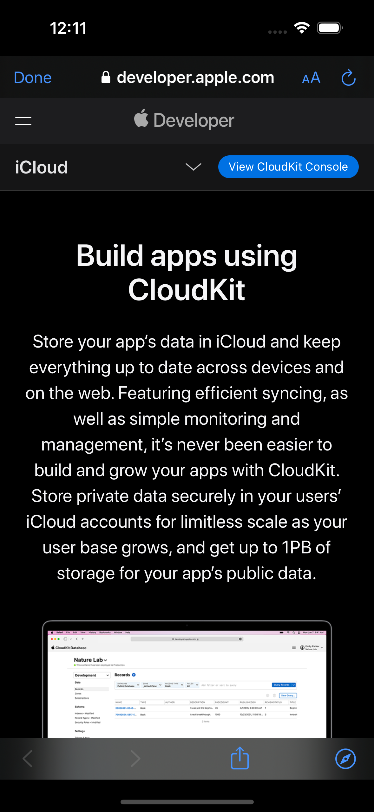

# Apple Frameworks App

## Table of contents
* [Video Link](#video-link)
* [Description](#description)
* [Features](#Features)
* [Screenshots](#screenshots)
* [Architecture](#architecture)
* [Contact](#contact)

## Video Link

[AppleFrameworksApp](https://www.linkedin.com/feed/update/urn:li:activity:7147247534195867648/)

## Description

- Discover the World of Apple Frameworks with the 'Apple Frameworks' app. Immerse yourself in an elegantly designed grid and list interface, exploring a curated collection of Apple Frameworks. Seamlessly transition from grid to list views with the power of SwiftUI. Dive deeper into framework details through user-friendly sheet or full-screen presentations. When you're ready to learn more, the integrated Safari experience ensures a smooth journey. Underneath it all, the app is meticulously crafted with SwiftUI state management following the MVVM design pattern.

## Features 

### 1.Displaying Data in a Grid:

- The app "Apple Frameworks," elegantly presents a curated collection of Apple Frameworks to users in a visually pleasing grid format. This is achieved through the seamless utilization of SwiftUI's `ScrollView` and `LazyVGrid` components. Users can effortlessly navigate through this grid, selecting their preferred Apple Frameworks to gain further insights.

### 2.Display Data in a List:

- With a simple tap on the toolbar button, users can seamlessly transform the interface of the Apple Frameworks grid into a meticulously designed list view. This transition is made possible by leveraging SwiftUI's `List` component and harnessing the power of `NavigationLink` to navigate. Each item in the list opens up a dedicated detail view, allowing for a more exploration of each framework.

### 3.Display Framework Detail View:

- The framework detail view is where users can delve deeper into the world of Apple Frameworks. Depending on their preferred layout `Grid` or `List` the detail view is thoughtfully presented as a sheet or a full-screen experience. Within this view, users are greeted with an image representation of the framework, a concise yet informative description, and a "Learn More" button. This button directs users to Safari, offering an opportunity to explore an even more comprehensive understanding of the chosen framework.

### 4.Display more information using Safari:

- To seamlessly transition from our app to Safari and deliver an enriching web-browsing experience, this app harnessed the power of the `UIViewControllerRepresentable` protocol. This protocol allows for a harmonious integration between UIKit's `SFSafariViewController` and SwiftUI using our custom object, `SafariView`. This level of detail ensures that our users have a seamless and uninterrupted exploration of Apple Frameworks, both within the app and through Safari.

### 5. State Management using SwiftUI:

- The Apple Frameworks is designed with the state management, powered by SwiftUI. We've thoughtfully implemented the Model-View-ViewModel (MVVM) design pattern and harnessed SwiftUI's arsenal of property wrappers like `@StateObject`, `@ObservedObject`, the `ObservableObject` protocol, and `@Published`. This architecture ensures that the app's user interface remains responsive and data flows smoothly, guaranteeing a seamless and delightful user experience.

## Screenshots

Grid Layout Screen         |  Grid Layout Detail Screen
:-------------------------:|:----------------------------:
          |  

List Layout Screen         |  List Layout Detail Screen
:-------------------------:|:----------------------------:
          |  

Safari View Screen         |
:-------------------------:|
          |

## Architecture

### MVVM

#### Model:

- The Model layer is responsible for representing the data from our business logic.

#### View:

- The View layer is responsible for handling all the layouts and displaying the data user-friendly. 
- The View knows the ViewModel but doesn't know the model.

#### ViewModel:

- The ViewModel layer is responsible for transforming the data received in a View-representative way, receiving actions from the View, and dealing with our business logic.
- The ViewModel Knows the Model layer but doesn’t know the View layer.
- It contains data binding that tells whoever is listening about those changes using the Combine framework. 

## Contact
Kevin Topollaj, email: kevintopollaj@gmail.com - feel free to contact me!
