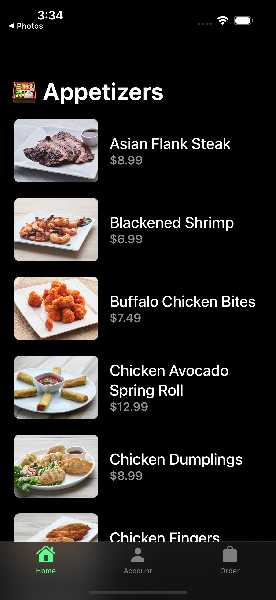
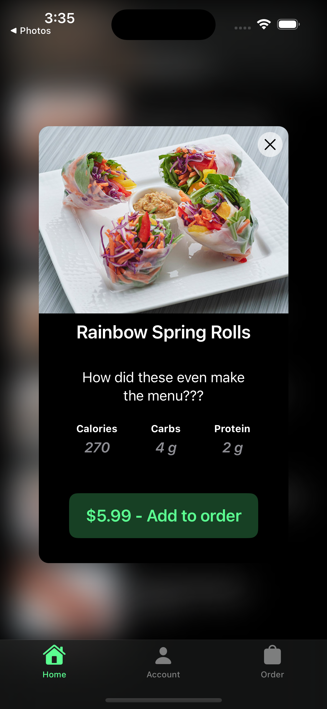
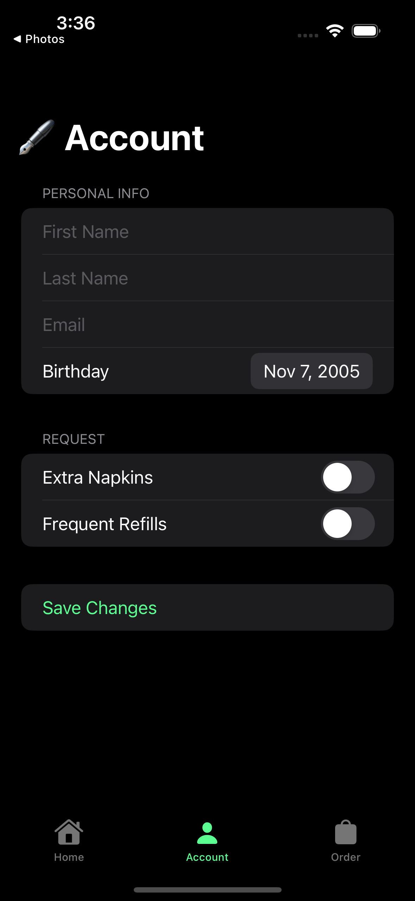
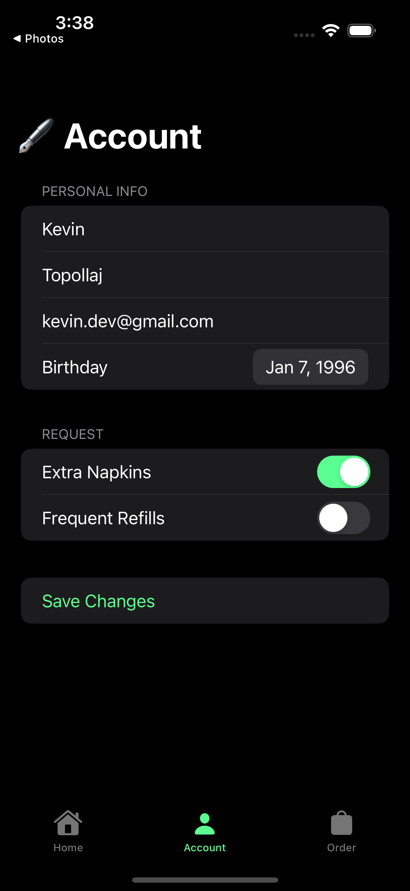
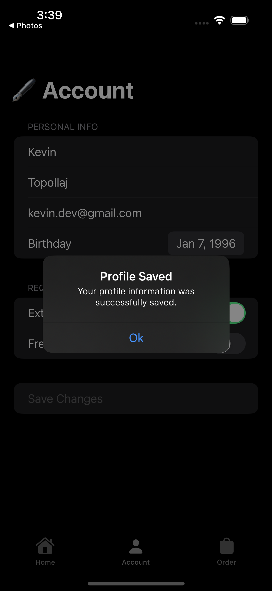
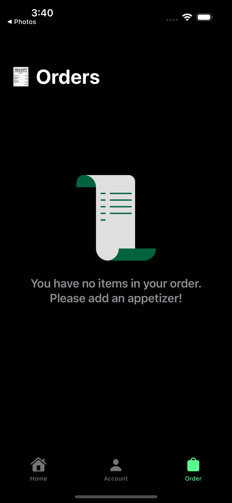
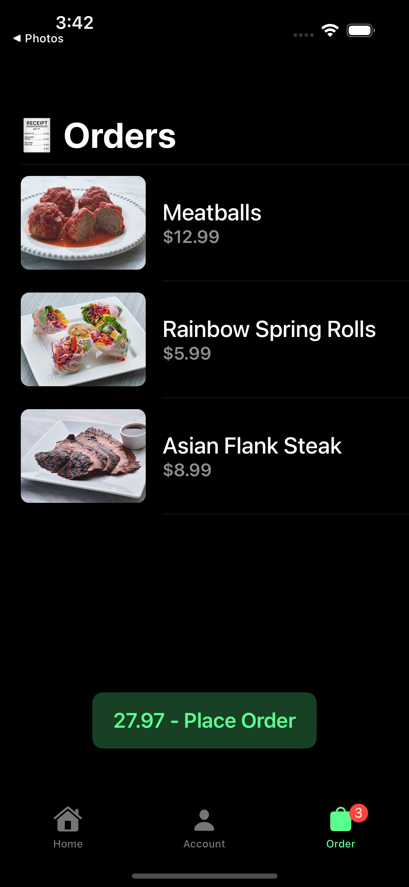
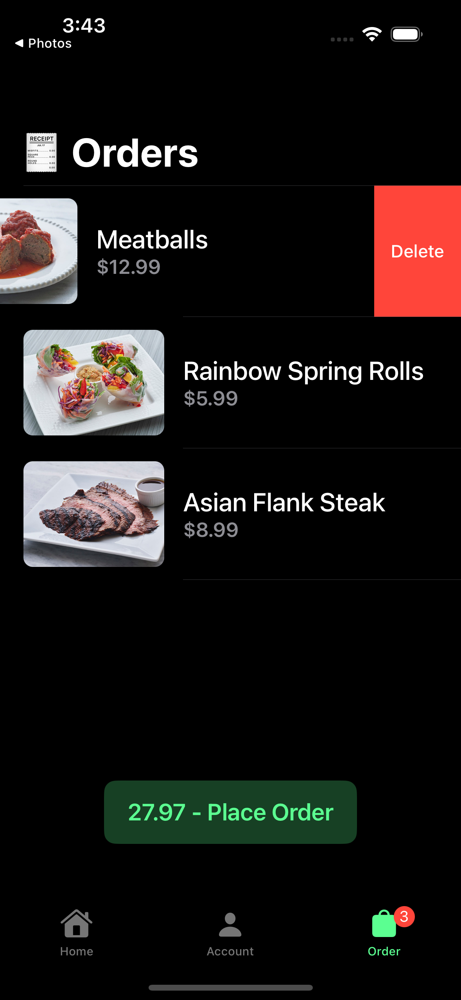
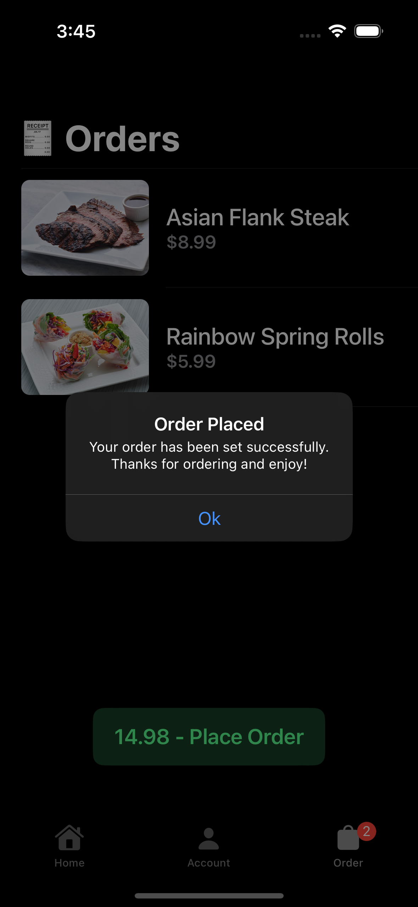

# Appetizers App

## Table of contents
* [Video Link](#video-link)
* [Description](#description)
* [Features](#Features)
* [Screenshots](#screenshots)
* [Architecture](#architecture)
* [Contact](#contact)

## Video Link

[AppetizersApp]()

## Description

- Discover culinary excellence with the Appetizers app. It offers a seamless user experience, featuring a variety of screens for browsing appetizers, account to save your user detail, and efficiently managing orders. With state-of-the-art state management in SwiftUI, the app ensures a responsive and enjoyable user experience.

## Features 

### 1.TabView:

- Appetizers App has a TabView as its core, offering users three distinct screens, each catering to different functionalities, ensuring a comprehensive and intuitive user experience.

### 2.Appetizer List Screen:

- Appetizer List is the initial screen of the app, it seamlessly fetches data from an API via a NetworkManager. Utilizing the power of Async/Await, it efficiently retrieves both appetizer list with details and images and shows a loading view in the mean time. To enhance user experience and preserve memory resources, the app intelligently caches images.

### 3.Appetizer Detail Screen:

- When a user selects a specific appetizer from the list, the app responds with an immersive detail popup. This interface elegantly presents the appetizer's image, name, description, nutritional information, and a convenient ordering button. Users can explore appetizers and place orders with ease, enhancing their overall dining experience.

### 4.Account Screen:

- The Account Screen contains a user-friendly Form view, organized into three insightful sections. The first section allows users to input personal information, such as their first name, last name, email, and birthdate. The second section accommodates additional requests, such as extra napkins and frequent refills. Finally, a dedicated button enables users to save this information, ensuring persistence across app sessions.

### 5.Order Screen:

- The Order Screen adapts dynamically, featuring either an empty view if there are no appetizers ordered by the user or a comprehensive list of the user's ordered appetizers and they can also swipe to delete a specific appetizer. It calculates the order's total, empowering users to efficiently place their orders. Once an order is confirmed, the list resets, ready for new appetizers. The order tab conveniently displays a badge indicating the number of appetizers in the order list, making the process both user-friendly and intuitive.

### 6. State Management using SwiftUI:

- Appetizers app embraces cutting-edge state management, driven by the SwiftUI framework. Grounded in the Model-View-ViewModel (MVVM) design pattern, the app expertly leverages property wrappers, including `@StateObject`, `@ObservedObject`, `@EnvironmentObject`, and object that conform to the `ObservableObject` protocol, with the `@Published` properties. This architectural approach ensures a highly responsive user interface and seamless data flow, guaranteeing a delightful user experience.

## Screenshots

Loading Screen             |  Appetizer List Screen
:-------------------------:|:----------------------------:
          |  

Appetizer Detail Screen    |  Empty Account Screen
:-------------------------:|:----------------------------:
          |  

Filled Account Screen      |  Saved Profile
:-------------------------:|:-------------------------:
          |  

Empty Order Screen         |  Order List Screen
:-------------------------:|:-------------------------:
          |  

Swipe to Delete in Order Screen  |  Order List Screen
:-------------------------------:|:-------------------------:
                |  

## Architecture

### MVVM

#### Model:

- The Model layer is responsible for representing the data from our business logic.

#### View:

- The View layer is responsible for handling all the layouts and displaying the data user-friendly. 
- The View knows the ViewModel but doesn't know the model.

#### ViewModel:

- The ViewModel layer is responsible for transforming the data received in a View-representative way, receiving actions from the View, and dealing with our business logic.
- The ViewModel Knows the Model layer but doesn’t know the View layer.
- It contains data binding that tells whoever is listening about those changes using the Combine framework. 

## Contact
Kevin Topollaj, email: kevintopollaj@gmail.com - feel free to contact me!
