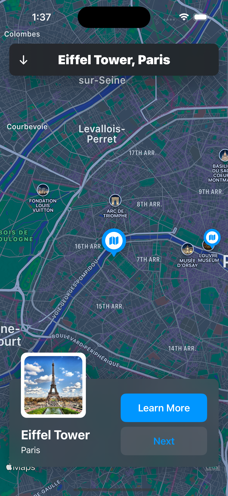
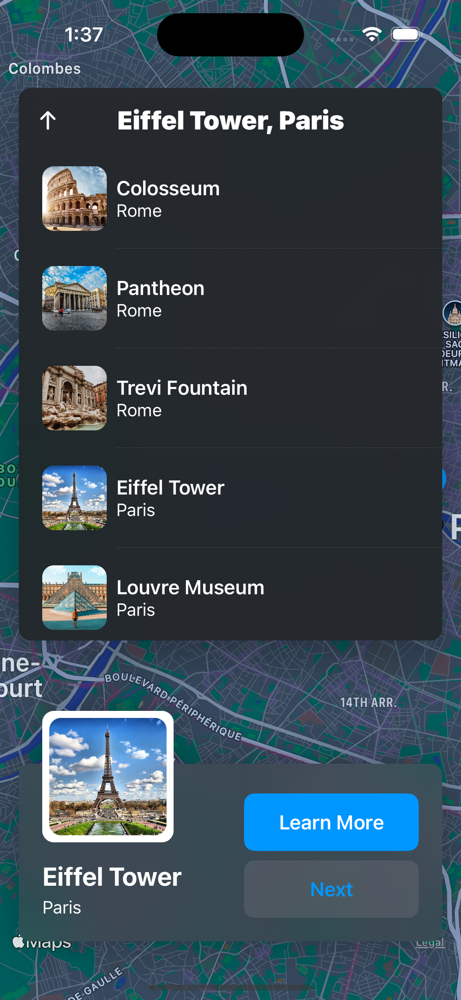
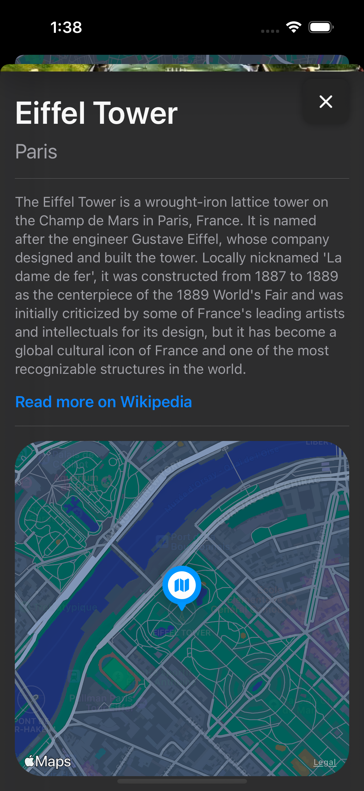

# Locations App

## Table of contents
* [Video Link](#video-link)
* [Description](#description)
* [Features](#Features)
* [Screenshots](#screenshots)
* [Architecture](#architecture)
* [Contact](#contact)

## Video Link

[Locations](https://www.linkedin.com/feed/update/urn:li:ugcPost:7133551362553827328/)

## Description

Embark on a captivating journey with the Locations app in SwiftUI. Explore the interactive map with custom pin annotations and an expandable header that reveals a curated list of destinations. Dive into Location Previews at the bottom of the map, offering a glimpse of each location. Navigate seamlessly with "Learn More" and "Next" buttons for continuous discovery. Immerse yourself in each Location Detail screen containing scrollable images, descriptions, and Wikipedia links. Expand your horizons further with Safari Information, seamlessly connecting you to access more knowledge for each location. Elevate your exploration with this dynamic and feature-rich Locations app.

## Features 

### 1.Displaying the Map:

- Immerse yourself in an interactive map experience powered by the Map Kit framework. Locations app introduces custom pin annotations, offering a dynamic view of your surroundings. The map has a versatile layout, featuring a top header displaying the current location's name, that expands to reveal a comprehensive list of available locations. At the bottom, a captivating location preview showcases the photo, name, and city of the location. Enhance your exploration with "Learn More" and "Next" buttons, seamlessly guiding you to discover more destinations.

### 2.Expandable header list:

- Unlock the full potential of your journey with the Expandable Header List feature. Delve into detailed information by selecting the location header, that expands a curated list of great locales. Each item in the list contains an image, location name, and city. Navigate effortlessly by choosing a destination, instantly updating the map, header, and location preview. Tailor your experience with this dynamic and informative feature.

### 3.Location Previews:

- Elevate your anticipation with Location Previews positioned at the map's bottom. Each preview unveils a captivating image, location name, and city. Seamlessly transition to deeper insights by selecting the "Learn More" button, providing access to detailed information on the location. Or you can continue the exploration with the "Next" button, to discover more locations.

### 4.Location Detail:

- Delve into the heart of each destination with the Location Detail feature. Immerse yourself in a visually appealing interface offering scrollable images of the location, the location's name, city, a concise description, a link to explore more and a close-up map view. Your exploration is enhanced with rich, detailed content for a truly immersive journey.

### 5.Safari Information:

- Uncover the knowledge with the Safari Information screen. Seamlessly transition from the Location Detail screen to Safari, where a curated Wikipedia link awaits. An in depth information about the selected location, enriching your understanding and providing a comprehensive experience.

## Screenshots

Map Screen                 |  Location List Screen
:-------------------------:|:-------------------------:
 | 

Location Detail Screen 1   |  Location Detail Screen 2
:-------------------------:|:-------------------------:
 | 

Safari Screen              | 
:-------------------------:|
 |

## Architecture

### MVVM

#### Model:

- The Model layer is responsible for representing the data from our business logic.

#### View:

- The View layer is responsible for handling all the layouts and displaying the data user-friendly. 
- The View knows the ViewModel but doesn't know the model.

#### ViewModel:

- The ViewModel layer is responsible for transforming the data received in a View-representative way, receiving actions from the View, and dealing with our business logic.
- The ViewModel Knows the Model layer but doesn’t know the View layer.
- It contains data binding that tells whoever is listening about those changes using the Combine framework. 

## Contact
Kevin Topollaj, email: kevintopollaj@gmail.com - feel free to contact me!
