# Crypto Portfolio App

## Table of contents
* [Video Link](#video-link)
* [Description](#description)
* [Features](#Features)
* [Screenshots](#screenshots)
* [Architecture](#architecture)
* [Contact](#contact)

## Video Link

[Crypto Portfolio]()

## Description

The Crypto Portfolio app in SwiftUI is a sophisticated investment management app offering users a polished and immersive experience. With an elegant UI theme and reusable networking layer powered by Combine, users can seamlessly retrieve and display real-time data from the API. The app features intuitive search and filtering, a comprehensive Home screen with a custom navigation header, and dedicated screens for coin details, portfolio management, and editing. Users can efficiently manage their portfolios, with robust data persistence using Core Data, and a comprehensive Settings screen, thoughtfully organized into sections for intuitive navigation and a seamless user experience.

## Features

### 1.Project Setup and UI Theme:

- Elevate visual aesthetics by utilising assets and implementing a dedicated Color extension, introducing a unified ColorTheme for a sophisticated and polished user interface.

### 2.Create a Reusable Networking Layer with Combine:

- Establish a versatile Networking layer with Combine, ensuring efficient data retrieval. Implement a systematic model creation approach for each JSON structure, seamlessly fetching real-time data from the API through the Service layer and integrating it into the ViewModel for a cohesive View experience.

### 3.Creating Home Screen and a custom Navigation Header:

- Craft an engaging Home View with a customized Navigation Header, complemented by a CoinRow View to elegantly display comprehensive data for each cryptocurrency.

### 4.Created Portfolio Screen:

- Introduce a dedicated Portfolio Screen for users to effectively manage and monitor their cryptocurrency investments, providing a seamless and organized portfolio management experience.

### 5.Search and Filtering of coins:

- Enhance user experience with intuitive search and filtering functionalities, empowering users to effortlessly locate and monitor specific coins within the application.

### 6.Created Coin Detail Screen:

- Develop an immersive Coin Detail Screen, offering users comprehensive insights into specific cryptocurrencies, also using charts to ensure a rich and informative user experience.

### 7.Created Edit Portfolio Screen:

- Elevate user interaction with a thoughtfully designed Edit Portfolio Screen, facilitating seamless modification of portfolio details for a personalized investment tracking experience.

### 8. Save user portfolio to Core Data:

- Implement robust data persistence by seamlessly saving and updating user portfolios using Core Data, ensuring data integrity and persistence across app sessions.

### 9. Settings screen using a List with Sections:

- Provide users with a comprehensive Settings screen, thoughtfully organized into sections for intuitive navigation and a seamless user experience.

## Screenshots

Launch Screen              |  Home Screen
:-------------------------:|:-------------------------:
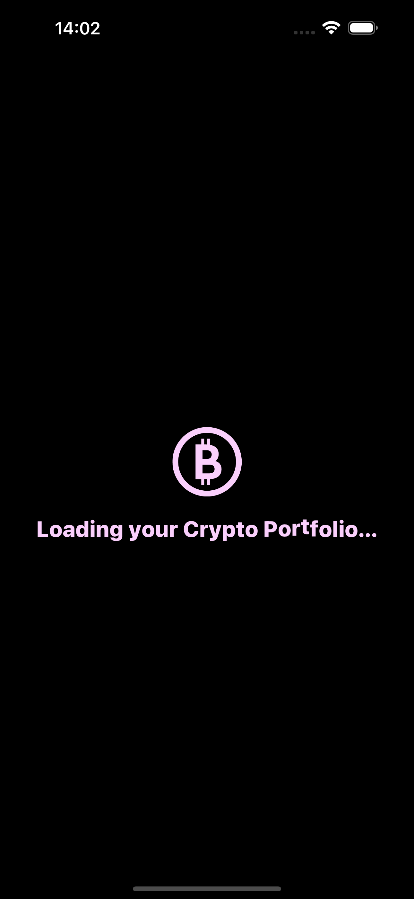 | 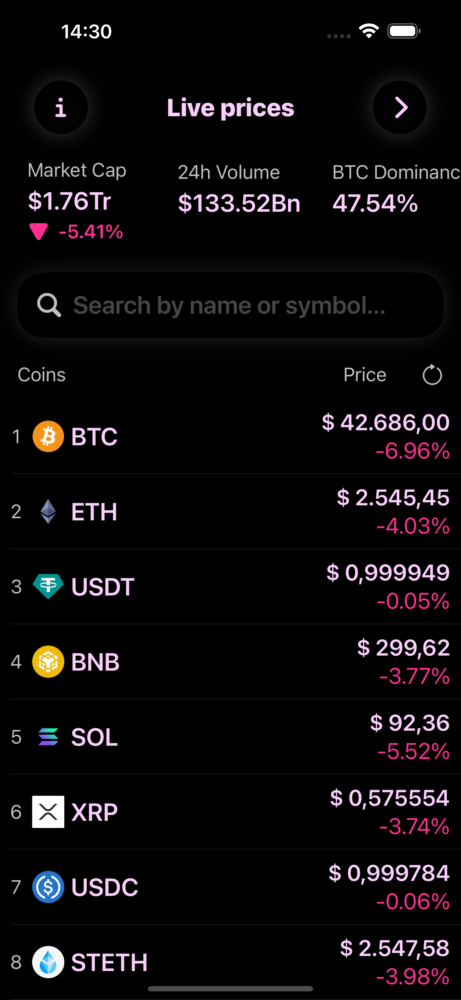

Portfolio Screen           |  Coin Detail Screen 1
:-------------------------:|:-------------------------:
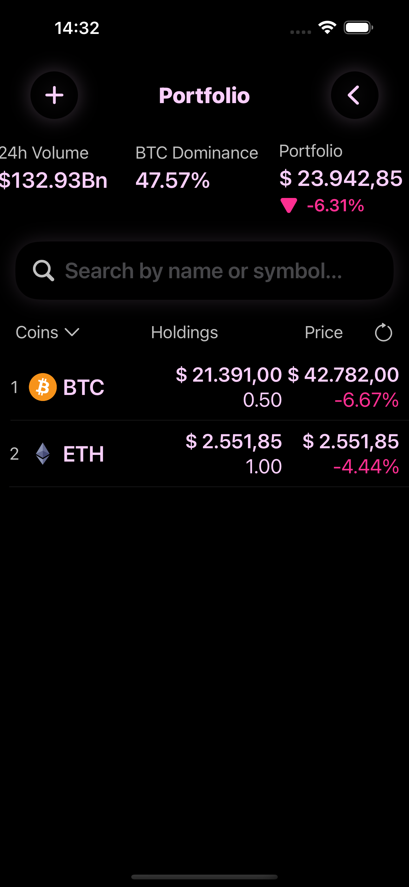 | 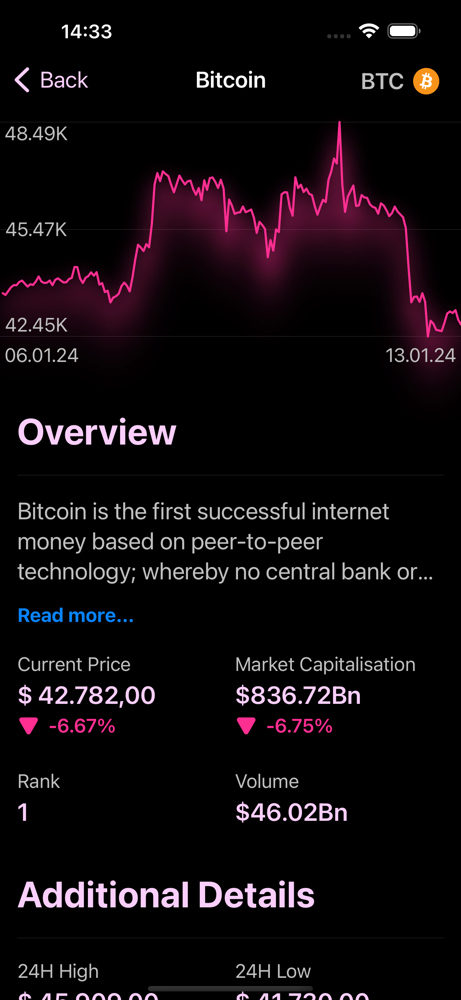

Coin Detail Screen 2       | Settings Screen
:-------------------------:| :-------------------------:
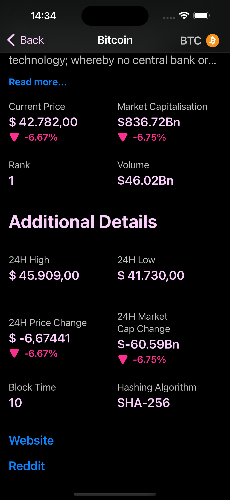 | 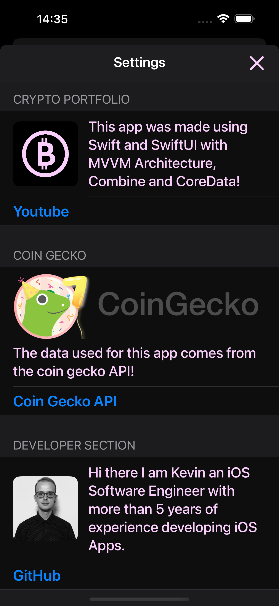

Search in Home Screen      | Search in Portfolio Screen
:-------------------------:| :-------------------------:
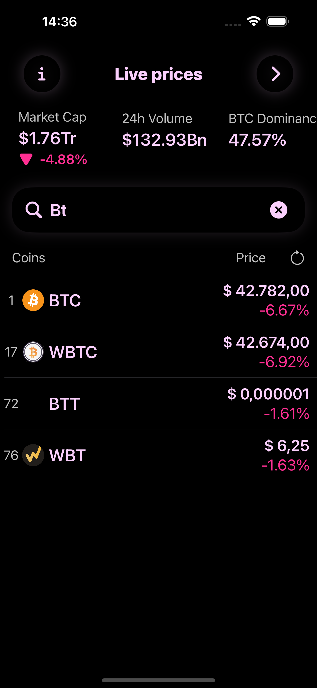 | 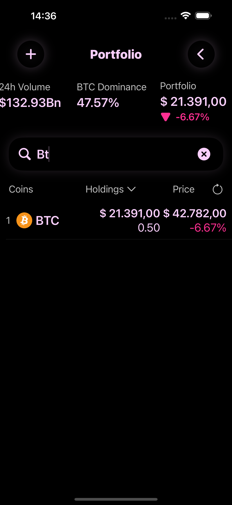

Edit Portfolio Screen      | Search in Edit Portfolio Screen
:-------------------------:| :-------------------------:
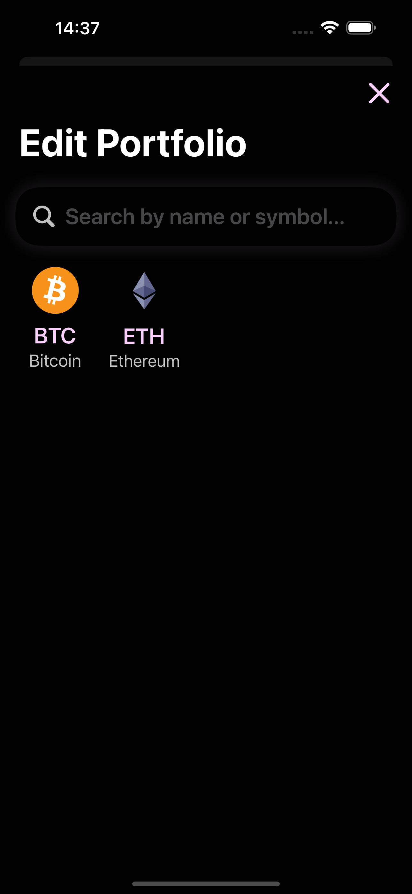 | 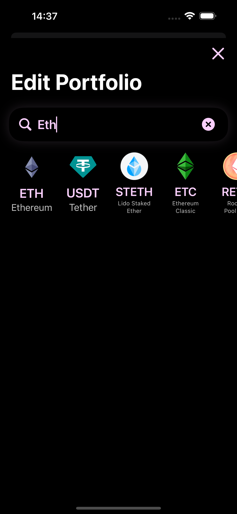

Edit Portfolio Coin Selection | Sort by coin in Portfolio
:----------------------------:| :-------------------------:
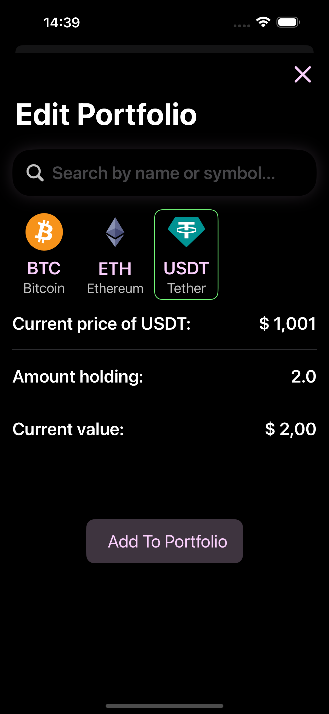 | 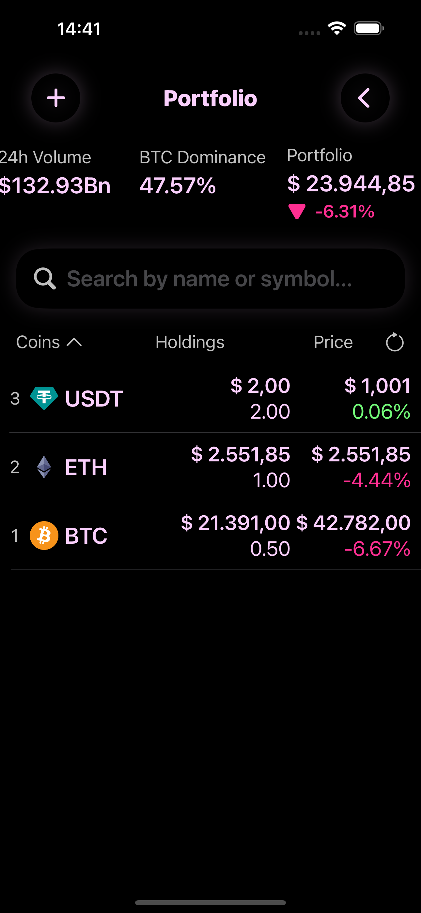

## Architecture

### MVVM

#### Model:

- The Model layer is responsible for representing the data from our business logic.

#### View:

- The View layer is responsible for handling all the layouts and displaying the data user-friendly. 
- The View knows the ViewModel but doesn't know the model.

#### ViewModel:

- The ViewModel layer is responsible for transforming the data received in a View-representative way, receiving actions from the View, and dealing with our business logic.
- The ViewModel Knows the Model layer but doesn’t know the View layer.
- It contains data binding that tells whoever is listening about those changes using the Combine framework. 

## Contact
Kevin Topollaj, email: kevintopollaj@gmail.com - feel free to contact me!
