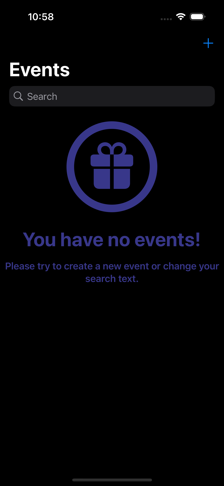
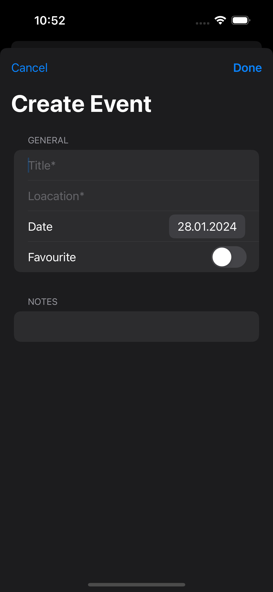
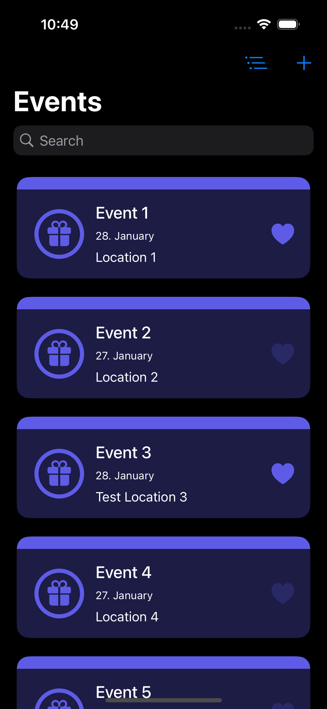
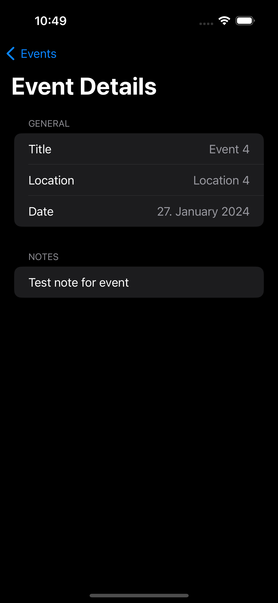
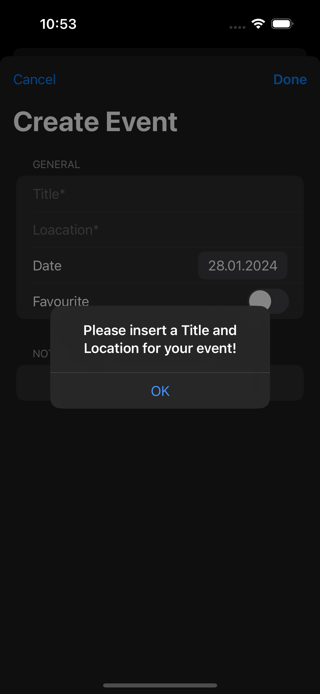
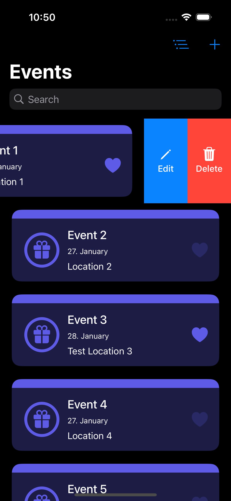
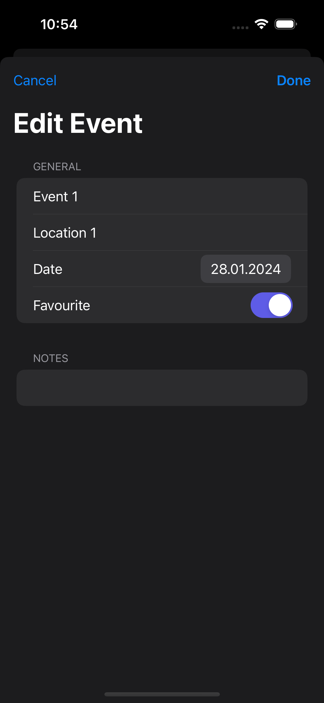
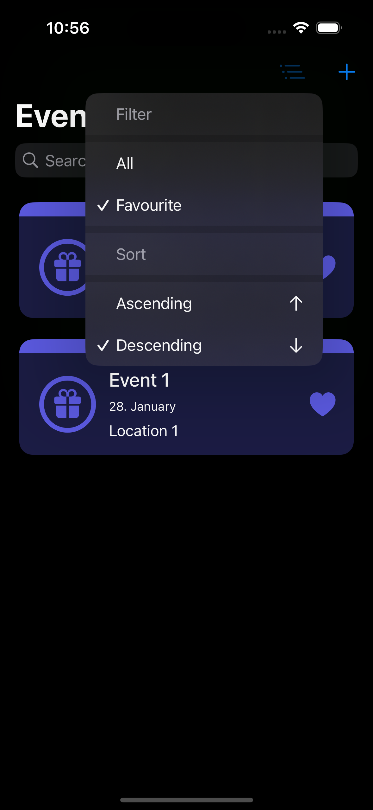

# My Events App

## Table of contents
* [Video Link](#video-link)
* [Description](#description)
* [Features](#Features)
* [Screenshots](#screenshots)
* [Architecture](#architecture)
* [Contact](#contact)

## Video Link

[My Events](https://www.linkedin.com/feed/update/urn:li:activity:7157447246194618369)

## Description

Welcome to My Events app, where SwiftUI seamlessly integrates with Core Data for a refined event management experience. Persist your data effortlessly with Core Data integration for a reliable storage. Retrieve and showcase events easily, and intuitively edit their details on the go. Manage events with a straightforward swipe to delete process, and empower users with smart search functionality. You can also mark your special events as favorites for quick access. Fine-tune your viewing experience with advanced sorting and filtering options seamlessly integrated with Core Data. My Events provides a user-friendly app for personalized and efficient event organization.

## Features

### 1. Persistent Data Management with Core Data in SwiftUI:

- The app manages and organizes the data with the integration of Core Data into SwiftUI project. This introduces the benefits of a robust data persistence while maintaining a fluid and responsive user interface.

### 2. Event Storage with CoreData:

- Capture and store your events effortlessly using the power of CoreData. Seamlessly integrate event data into the app for a reliable and efficient storage solution.

### 3. Retrieve Events from Core Data:

- Retrieve and display your saved events with Core Data. Enhance the experience by fetching and presenting stored data in SwiftUI.

### 4. Event Editing with Core Data:

- Easily modify and customize your events using Core Data editing functionality that provides users with a user-friendly experience when updating their event details.

### 5. Event Deletion from Core Data:

- Efficiently manage your events by easily deleting them from the Core Data storage.

### 6. Event Search in Core Data:

- Enable users to find specific events quickly with the search functionality powered by Core Data.

### 7. Filter and Sort events in Core Data:

- Tailor your event viewing experience with advanced filtering and sorting options integrated with Core Data. Allows users to effortlessly organize and prioritize their favourite events.

## Screenshots

No Events Screen           |  Create Event Screen
:-------------------------:|:-------------------------:
 | 

Events List Screen         |  Event Detail Screen 
:-------------------------:|:-------------------------:
 | 

Create Event Validation    | Event swipe actions
:-------------------------:| :-------------------------:
 | 

Edit Event Screen          | Search Events
:-------------------------:| :-------------------------:
 | 

 No Searched Event found   | Filter and Sort Events
:-------------------------:| :-------------------------:
 | 

## Architecture

### MVVM

#### Model:

- The Model layer is responsible for representing the data from our business logic.

#### View:

- The View layer is responsible for handling all the layouts and displaying the data user-friendly. 
- The View knows the ViewModel but doesn't know the model.

#### ViewModel:

- The ViewModel layer is responsible for transforming the data received in a View-representative way, receiving actions from the View, and dealing with our business logic.
- The ViewModel Knows the Model layer but doesn’t know the View layer.
- It contains data binding that tells whoever is listening about those changes using the Combine framework. 

## Contact
Kevin Topollaj, email: kevintopollaj@gmail.com - feel free to contact me!
